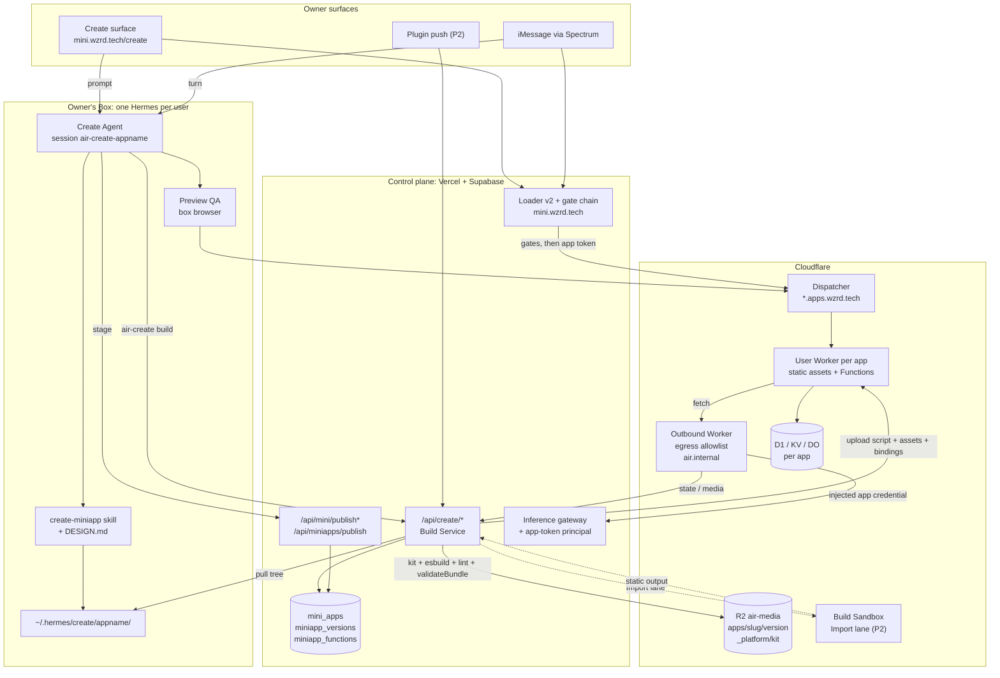

# goal.md: Air Create (V11)

| Field | Value |
| --- | --- |
| Status | Build specification |
| Target | Private beta, 10 to 100 owners; correctness and isolation over scale |
| Primary outcome | Any Air owner can turn a file, a folder, or a sentence into a live iMessage mini-app at `mini.wzrd.tech/<username>/<app-name>` — with an optional backend — without a deploy, an operator, or a leaked secret |
| Surface | `mini.wzrd.tech/create` (first-party mini-app, slug `create`) plus the same flows over iMessage |
| Placement | Root `goal.md` once V10 ships; until then `docs/goal-create-v11.md`. Either way this file is the spec of record for Create |
| Last verified | 2026-09-03 against `gratitude5dee/airv2` @ `8baeb15` (PR #328) |

Read [ARCHITECTURE.md](../ARCHITECTURE.md), [SECURITY-DECISIONS.md](../SECURITY-DECISIONS.md), [docs/goal-miniapps-v9.md](goal-miniapps-v9.md) (the substrate this extends), and [design.md](../design.md) before implementation. Those files define the platform boundary and the canonical language used here. If this specification conflicts with `ARCHITECTURE.md` or a live security decision, this specification is wrong.

The Mini-Apps V9 plan is complete. The Learning Plane V10 plan (`goal.md` at the time of writing) remains in force and is untouched by this file; `trace_id` propagation (V10 §8) is reused, not re-specified. Do not rebuild either.

## 0. The outcome

Build **Create**: the lane by which owners (and their agents) make mini-apps instead of only using them.

Three ways in, one way out:

| Lane | Input | What happens | Time to live URL |
| --- | --- | --- | --- |
| **Drop** | A file, a folder, a zip, a single `index.html` — dragged onto the web surface, texted as an iMessage attachment, or pushed from a plugin | Validated, stored as an immutable version, served on the app's own origin | Seconds |
| **Vibe** | A sentence, a sketch, a screenshot, a link to something to imitate | The owner's agent plans and writes a project from the vendored **Kit** (preset libraries), the platform **Build Service** compiles it, the owner watches a live draft and iterates by prompt or by hand | One to three minutes to first draft |
| **Import** | A whole project (`package.json`, Vite/Next static export, an existing repo) | A **Repo Scan** by the planning model explains the architecture and what the mini-app version needs, then a disposable **Build Sandbox** compiles it | Minutes; P2 |

Every lane ends in the same place: a **draft** the owner previews privately, a one-tap **publish** decision (Needs-you), and a live app at `mini.wzrd.tech/<username>/<app-name>` that renders inside Messages, in web chat, and in the native Apps tab, with rollback in one pointer move.

An app may declare an optional **backend** ("Functions"): platform-hosted, per-app isolated, with its own database, key-value store, secrets, and a budgeted line to model inference — all reachable from the app on its own origin, none of it requiring the owner to hold a key, run a server, or read a Cloudflare dashboard.

### 0.1 What Create is not

Create is not a general web host, not a CI system, not an IDE, and not a way for a stranger to run code near an owner's Box. It produces mini-apps that obey the mini-app contract (V9 §4, this file §6) and nothing else. If a request needs more than that contract allows, the answer is "escalate" (§20), not "widen the CSP".

### 0.2 The golden paths

**Drop over iMessage.** An owner texts their agent an `index.html` with "host this as promo".

1. The inbound route materializes the attachment into the Box exactly as today (`lib/orchestrator/flush.ts` `materializeAttachments` → `/home/user/.hermes/inbox/<ts>-index.html`, and the model is told the path) and the turn runs in `air-main`.
2. The `create-miniapp` skill recognizes a hosting request and runs `air-create drop /home/user/.hermes/inbox/<ts>-index.html --name promo`. The script calls `POST /api/create/drop` with the Box's gateway token; the control plane pulls the bytes out of the Box (capped, like `/api/media/publish`), runs `validateBundle`, stores version `v<epoch>` under the app's prefix, creates the registry draft if needed, and returns a preview URL.
3. The agent replies with one sentence and a draft card (`[card: app promo]`). The owner taps it and sees the page inside Messages.
4. The owner replies "publish". The skill calls the existing `POST /api/miniapps/publish` route, which files a `miniapp_publish` decision. The Needs-you card flips to "Published ✓" in place when tapped. The app is live at `mini.wzrd.tech/<username>/promo`; the agent sends the link as a rich link.

Nothing in that path stored a URL, put a secret in a bundle, or let the agent flip a status.

**Vibe on the web.** An owner opens `mini.wzrd.tech/create`, types "a countdown to my October 3 show with a link to tickets, in the atmosphere theme".

1. The Create surface starts a project (`~/.hermes/create/countdown/` in the Box) and a Hermes session `air-create-countdown`. The planning model (Deep tier) reads `packages/create-kit/DESIGN.md`, picks `fancy/basic-number-ticker`, `fancy/typewriter`, and the Air `theme.css`, and writes `air.json` + `src/`.
2. The skill calls `POST /api/create/build`. The Build Service pulls the project tree from the Box, compiles it with pinned esbuild against the vendored Kit, runs the CSP linter, validates the bundle, stores a draft version, and (if `air.json.functions` exists) deploys a draft user Worker.
3. The Create surface's preview frame reloads on the draft. The agent runs Preview QA in the Box browser at iPhone sizes and fixes what it finds. Each iteration is one prompt, one build, one reload.
4. "Publish it, unlisted, password `tour`" → the password via the existing `PATCH /api/mini/publish`, the visibility with the status flip (`POST /api/mini/publish/status {status, visibility}`), then the publish decision. Approve → live.

**Enable a backend.** "Add an RSVP list so people can say they're coming." The agent adds `functions/index.ts` with one route and `"db": true` to `air.json`. The build deploys a draft Worker with its own D1 database; the app calls `/api/rsvp` on its own origin; the Worker reads `X-Air-Role` to decide what a guest may write. Publishing a backend is a `miniapp_backend` decision that shows the owner exactly what the backend may reach (nothing, by default) and spend (nothing, by default).

## 1. Existing substrate and what changes

Extend the platform. Do not create a parallel registry, session, storage, or agent system.

| Existing system | Location | Create use |
| --- | --- | --- |
| Registry v2 (`mini_apps`, `RegistryApp`) | `supabase/migrations/0007_miniapps.sql` (table) + `0034_miniapp_store.sql` (store columns), `apps/web/lib/miniapps/registry.ts` | Single source of truth. Create adds columns, never a second table of apps |
| Loader v2 and gate chain | `apps/web/app/mini/[app]/route.ts`, `lib/miniapps/gates.ts` (`runGateChain`: visibility → password → x402 → session) | Unchanged order; gains nested paths and a redirect to the app origin for published bundles |
| Publisher pipeline | `lib/miniapps/publish.ts` (`createDraft`, `updateGateSettings`, `setPublishStatus`, `validateAppName`, `slugFor`), `lib/miniapps/bundles.ts` (`validateBundle`, `bundleKey`, `uploadBundle`), `lib/miniapps/bundleLimits.ts` | Reused verbatim for Drop; the Build Service feeds the same validator |
| Publisher UI | `app/mini/(store)/publish/page.tsx`, `publish/create/page.tsx` (4-step Creator) | Folded into the Create surface; `/publish/create` 308s to `/create` |
| Apps API | `app/api/apps/v1/{state,action,media-upload-url}`, `lib/miniapps/appsApi.ts` (`appsApiSession`) | Kept as the state seam; accepts an app-origin bearer in addition to the `mini_api_<slug>` cookie |
| Agent-staged publish | `app/api/miniapps/publish/route.ts` (gateway-token auth, `createDraft` + `miniapp_publish` decision) | The only way an agent publishes. Unchanged |
| Box-side app state | `lib/miniapps/store.ts` (`.hermes/miniapps/<app>/<resource>.json`) | Unchanged; Functions reach it through the runtime API, never directly |
| Backing-tool idiom | `infra/template/skills/*/SKILL.md` (`BASE="${OPENAI_BASE_URL%/api/gateway/v1}"`, `Bearer $OPENAI_API_KEY` = gateway token) | The `create-miniapp` skill uses exactly this |
| Turn execution | `lib/hermes/client.ts` (`createRun`, `MAIN_SESSION="air-main"`, `runEvents`), `lib/orchestrator/boxes.ts` (`ensureBoxAwake`, `armStopAfter`), `lib/compute/runtime.ts` (`runCommand`, `readComputeFile`, `writeComputeFile`) | The Create Agent is the owner's Hermes; builds pull files through `runCommand` |
| Prompt bar | `lib/miniapps/promptBar.ts`, `app/api/mini/agent/route.ts` | Create's chat pane is this route's shape with a per-project session id and a per-run model |
| Chat streaming | `lib/chat/relay.ts` (`chatEventStream`, `CHAT_SESSION_RE`), `app/api/chat/[runId]/events` | The relay is reused; the route is not — it is main-origin, main-session only, and the mini host 404s it. Create gets a mini-origin twin (§14.1) |
| iMessage cards | `lib/miniapps/cards.ts` (`mintSignedLink`, `sendMiniAppCard`, `updateMiniAppCard`), `cardSends.ts` (`CARD_KINDS`, 2-minute cooldown), `lib/orchestrator/outbound.ts` (`CARD_MARKER`) | Gains `create` and a per-slug `app` card kind; draft cards update in place |
| iMessage attachments | `lib/orchestrator/flush.ts` `materializeAttachments` | Drop over iMessage starts here |
| Inference gateway | `app/api/gateway/v1/[...path]`, `lib/entitlements/models.ts` (`TIER_MODELS`, `FAMILY_MODELS`, `add_spend`) | Gains a Create tier mapping and an app-token principal with per-app budgets |
| Storage | `lib/storage/r2.ts` (hand-rolled SigV4, `apps/<slug>/<version>/…`, `u/<username>/…`, `_platform/…`), `buckets.ts` (2 GiB quota), `guard.ts` (allowlist, secret scrub, EXIF strip) | Bundles and Kit artifacts; every write path still passes `guard.ts` |
| Limits and ops | `lib/security/limits.ts` (`ops_events`: `PUBLISHES_PER_DAY=20`, `UPLOADS_PER_HOUR=60`), `app/api/admin/ops` | Gains `build`, `deploy_fn`, `fn_capped` kinds |
| Release discipline | `lib/fleet/*` + migration `0068` (`template_releases`: immutable artifact, sha256 `checksum`, channel pointer) | The Kit and the platform Workers ship the same way |
| Discovery | `lib/miniapps/discovery.ts` (`IndexEntry`, `agentMd`, `llmsTxt`, `sitemapXml`, `jsonLd`) | Nested URLs and publisher pages join the projection |
| Themes | `design.md`, `lib/miniapps/themes.ts` (`ThemeTokens`, `themeCsp`), `shell.ts` (`LITE_CSS`) | Generated apps inherit the token contract through the Kit's `theme.css` |
| Security suites | `lib/security/c18.ts` + `{c18-sweep,c18-r2,redteam,ma11}.test.ts`, `scripts/c18-box-sweep.sh` | Every new gate, guard, and token ships its negative tests here |

### 1.1 What this file changes on purpose

Two V9 decisions are amended by this specification and nowhere else:

1. **MA3 ("no publisher server code")** becomes "no publisher code runs anywhere but a platform-isolated per-app Worker" (§11). V9 §2 said "escalate demand; do not build". Demand is now the product; the escalation is resolved by this file, under constraints CR6–CR10.
2. **`mini.wzrd.tech/<username>-<appname>`** becomes `mini.wzrd.tech/<username>/<appname>` as the canonical public URL (§6). The registry slug stays `<username>-<appname>`; only the URL changes. The flat form 301s.

One V9 decision is scoped: **MA10** ("the agent never learns mini-apps exist") holds for every app the owner uses. It does not hold for the Create lane, which is a backing tool by design, exactly as `miniapp_publish` and `storefront-commerce` already are.

## 2. Non-negotiable constraints

All C-, I-, MA-, and L-constraints remain in force. Add these Create constraints.

| ID | Constraint |
| --- | --- |
| CR1 | **Published code never shares an origin with a session.** Third-party bundles and their Functions are served from a per-app origin (`<username>-<appname>.apps.wzrd.tech`). `mini.wzrd.tech` keeps the store session, the first-party apps, and the gates; it never executes a published bundle's script. A published app cannot reach `/api/mini/*`, another app's cookies, or the store session by construction. |
| CR2 | **The mini origin gates; the app origin only verifies.** Visibility, password, x402, guest grants, and redemption logging run in the loader on `mini.wzrd.tech` (MA5, MA9). The app origin accepts nothing but a platform-minted, app-bound, 60-second token and its own host-only cookie. |
| CR3 | **A bundle is data until it passes `validateBundle` and the CSP linter.** Every lane — Drop, Vibe, Import, plugin push — feeds the same validator and lands in the same immutable `v<epoch>` version. There is no "trusted" upload path. |
| CR4 | **The agent stages; the owner publishes.** No agent, plugin, Worker, or build step flips `status` to `published` or widens a gate. Publishing and backend enablement are decisions (`miniapp_publish`, `miniapp_backend`), one tap each, resolved by the owner's session. |
| CR5 | **Untrusted builds never run in the primary Box.** The Build Service compiles only against the vendored Kit with a closed import allowlist. Anything that needs `npm install` of foreign dependencies (Import lane) runs in a disposable Build Sandbox with deny-by-default egress and is destroyed after the job. The Box holds the owner's mail key and vault; it does not run `postinstall` scripts from a stranger's repo. |
| CR6 | **Functions hold no platform credential.** A user Worker receives no model key, no R2 key, no gateway token, no Box URL, no Supabase credential (C2, C3, C16, C18). Platform services are reached only through the `https://air.internal/` virtual host, where the Outbound Worker injects a per-app credential the user code never sees. |
| CR7 | **Functions are deny-by-default on egress.** A user Worker's `fetch()` reaches only `air.internal` and the hostnames listed in its approved `air.json` `functions.egress` allowlist. TCP sockets are unavailable. The allowlist is shown verbatim in the `miniapp_backend` decision. |
| CR8 | **Functions spend the publisher's budget, capped per app per day.** Inference from an app resolves to the owner's entitlements through an app token, meters into `agent_runs`, and stops at `functions.ai.dailyCapUsd` (default 1.00, max 5.00) before it reaches the monthly cap. Anonymous visitors cannot spend more than the owner approved. |
| CR9 | **Functions never see who the owner is.** Identity headers carry an app-scoped pseudonymous principal (`HMAC(user_id, app_id)`), a role (`owner` / `guest` / `anon` / `agent`), the app slug, and the resource id. Never a user uuid, phone, email, wallet, or username. |
| CR10 | **Every Functions version is an immutable, checksummed artifact** deployed by the control plane through the vendor API, tagged `owner:<user_id>` and `app:<slug>`, with a recorded digest. Rollback is a pointer move. No `wrangler` from a working tree, no floating dependency (L12, C24). |
| CR11 | **The Kit is pinned and licensed per component.** `kit.lock.json` records source repo, commit, path, sha256, and license tier for every vendored file. Commons-Clause components (Tier B) compile into apps only, never appear in source exports or in a published package, and never enter a public repository. |
| CR12 | **No generated app loads anything the CSP forbids.** `default-src 'none'; script-src 'self'; style-src 'self' 'unsafe-inline'; connect-src 'self'` is the ceiling. No CDN, no web font, no analytics, no third-party iframe, no service worker, no client storage (C17). The Build Service fails the build; it does not warn. |
| CR13 | **Drafts are owner-only.** A draft version, a draft Worker, and a preview URL are reachable by the owner's session and by the owner's agent — never by a guest, a grant, a plugin token without `create:read`, or discovery. |
| CR14 | **Content stays out of Postgres (C4).** Source trees live in the Box; bundles and artifacts in R2 or the vendor; Functions data in the app's own D1/KV. Postgres holds versions, digests, sizes, status, and budgets. |
| CR15 | **Reserved words are complete.** `create`, `drop`, `functions`, `api`, `_air`, `preview`, `apps`, and every first-party slug (including the six missing today: `home`, `persona`, `feedback`, `berd`, `buzz`, `masterkey`) are reserved before nested routing ships. A username can never shadow a route. |
| CR16 | **Publishing is rate-limited and revocable.** Builds, deploys, and publishes count in `ops_events`; a suspended app 404s on the mini origin and its Worker is disabled at the vendor within one request; `POST /api/admin/delete` tears down the tenant's Workers, databases, and bundle prefix before cascading rows. |

## 3. Non-goals

V11 does not:

- give published apps custom domains, per-app subdomains other than the platform's `*.apps.wzrd.tech`, or raw DNS;
- run publisher code outside the dispatch namespace (no VMs, no containers at request time, no Box-hosted servers);
- let a Functions Worker bind the platform R2 bucket, the shared Postgres, a Box, or another app's resources;
- support cron triggers inside user Workers (the platform scheduler pings instead, P2), WebSocket fan-out beyond a per-app Durable Object (P2), or Python Workers;
- build a general IDE — Create edits files through the agent and a minimal editor, not a VS Code clone;
- vendor CanvasUI (license and WebKit fallback), `img-fx` (weight), or any library whose license forbids embedding;
- train, fine-tune, or evaluate models (V10 owns learning); Create emits `trace_id`s and content-free receipts only;
- charge a platform fee on Functions or inference resale (commercial decision, §20);
- rebuild any V9 surface. If Create needs something the publisher console does, extract and share the lib.

## 4. Canonical domain model

Implementation names must match this table (and `CONTEXT.md` once V10 introduces it; it does not exist at verification time).

| Term | Meaning |
| --- | --- |
| `Project` | An owner's working tree for one app: `~/.hermes/create/<appname>/` in the Box, or an upload in flight. Always owned by exactly one user |
| `Lane` | How a project entered: `drop`, `vibe`, `import`, `push` |
| `Manifest` (`air.json`) | The project's declaration: identity, entry, kit components, theme, actions, functions. Compiled into the bundle's `manifest.json` (superset of today's `{actions, guestActions}`) |
| `Bundle` | The static output that passes `validateBundle`: `index.html` at root, allowlisted extensions, ≤ 25 MiB zipped / 100 MiB unpacked / 500 files |
| `Version` | One immutable build: `v<epoch>`, its bundle digest, and (optionally) its Functions artifact digest. Rows in `miniapp_versions` |
| `Draft` | The version the owner is previewing. `mini_apps.draft_version` |
| `Live` | The version the public sees. `mini_apps.bundle_version` (existing column, unchanged meaning) |
| `Kit` | The vendored, pinned, licensed set of components, fonts, and theme CSS the Build Service resolves imports against. `packages/create-kit/` |
| `Design doc` | `packages/create-kit/DESIGN.md`: the Kit's catalog and doctrine, generated from component metadata; the Create Agent's primary reference |
| `Build Service` | Control-plane module that turns a project tree into a Version: esbuild + utility-CSS compile + CSP lint + `validateBundle` + Functions bundle |
| `Build Sandbox` | Disposable vendor sandbox for Import-lane builds that need foreign dependencies. Never the Box |
| `Functions` | The optional backend: one user Worker per app in the `air-apps` dispatch namespace, plus its bindings |
| `Dispatcher` | Platform Worker on `*.apps.wzrd.tech` that verifies app tokens, sets the app cookie, serves static assets, enforces the CSP, and routes `/api/*` to the app's Functions with identity headers |
| `Outbound Worker` | Platform Worker that intercepts every `fetch()` from user Workers: enforces `functions.egress`, and implements `https://air.internal/` |
| `App token` | 60-second HMAC token minted by the loader after the gate chain, bound to `(app, principal, role, resource, jti)`, exchanged once on the app origin for a host-only cookie |
| `Runtime API` | The allowlisted platform surface behind `https://air.internal/v1/*`: inference, state, media, notify |
| `Preview QA` | The agent's automated pass over a draft in the Box browser at iMessage viewport sizes |
| `Repo Scan` | The planning model's read of an imported project: framework, entry points, env needs, backend needs, mini-app fit; written to `create.plan.md` in the project |

### 4.1 Precedence

Resolve behavior in this order, highest first:

1. runtime kill switches (`publish_paused`, app `suspended`, Functions disabled at the vendor);
2. platform security policy (CSP ceiling, egress deny, credential absence);
3. owner entitlements, spend caps, and per-app budgets;
4. the approved `air.json` (gates, egress allowlist, budgets) — the approved copy, not the working tree;
5. defaults in this file.

A working-tree `air.json` that widens anything is ignored until the owner approves it again.

## 5. Owner experience

### 5.1 The Create surface (`mini.wzrd.tech/create`)

A first-party mini-app (`FIRST_PARTY_MODULES.create`, kind `input`, `access: single`, owner-only, `guestActions: []`). It renders the themed shell (`renderShell`) with a hydration island, the `image.tsx` pattern: `<div id="create" data-payload=…>` + `<script src="/creator-os/create.js" defer>`. The island is a React app built into `public/creator-os/` at build time (same as `identity-booth.js`, `image-editor.js`).

Layout, full browser: three regions.

- **Left — Chat.** The prompt bar bound to the project session (`air-create-<appname>`), streaming status from `GET /api/create/events/[runId]` (a mini-origin, store-session twin of `/api/chat/[runId]/events` over the same `chatEventStream` relay), the Speed & Intelligence tier picker (Fast / Balanced / Deep), and the project's build log (last 50 lines, content-free).
- **Center — Preview.** An iframe on the draft's app origin (`https://<username>-<appname>.apps.wzrd.tech/?t=<app token>`), with device presets: *Messages compact* (390×360), *Messages expanded* (390×760), *Phone* (390×844), *Desktop*. Reload on every successful build. A "lite" toggle mirrors `LITE_CSS` behavior so the owner sees what the webview will show.
- **Right — Project.** Tabs: **Files** (tree + a minimal editor for text files; saves write through `writeComputeFile`), **Versions** (drafts and live, digest, size, "Preview", "Make live" (decision), "Roll back"), **Functions** (enabled?, database, secrets, egress, budget, last 20 requests' status codes, "Enable backend" (decision)), **Settings** (name, description, theme → `PATCH /api/create/projects`; icon → `POST /api/mini/publish/icon`; access, password, price, plugin sign-in → the existing `PATCH /api/mini/publish`; visibility → the existing status route), **Share** (URL, QR via `lib/wallet/qr.ts`, "Send to my phone" card).

Layout, lite (Messages webview): one column — preview, prompt bar, "Publish" — and nothing that needs a keyboard shortcut.

The **empty state** is the three lanes as three tiles: *Drop files*, *Describe an app*, *Import a project*, with the owner's existing drafts listed under them. Drop accepts drag-and-drop of files and folders (folders are zipped client-side in the island — that code is ours and same-origin, so CR12 is satisfied), a zip, or a single HTML file (wrapped as `index.html`).

### 5.2 Over iMessage

| Owner says | What happens |
| --- | --- |
| `/create` | Existing slash-command lane (`parseMiniAppCommand`) opens the Create card |
| "host this" + attachment | Drop over iMessage (§0.2). Reply: one line + draft card |
| "build me a …" | Vibe in `air-main` (the skill, §9). Reply: one line, then a draft card when the first build lands; the card updates in place on later builds (`updateMiniAppCard`) |
| "make the button bigger" | Iteration on the most recent project in the session; same card, edited in place |
| "publish" / "publish it unlisted with password x" | Gate settings then the `miniapp_publish` decision card. Tap → live. Reply with the URL as a rich link |
| "who's using it" / "show me RSVPs" | The agent reads `.hermes/miniapps/<slug>/…` and, for Functions apps, calls the runtime API's owner-scoped state read. Never a database dump |
| "turn it off" | `status='suspended'` is an owner action through the Create surface or a decision; the agent stages, the owner confirms |

Cards for drafts use kind `app` with `resource_id = <slug>`; `card_sends`' `(user, kind)` cooldown means one app card per two minutes across all apps, which is the correct rate for a chat.

### 5.3 From a plugin (Codex / Claude Code) — P2

`plugin_tokens` gain a `scopes text[]` column. A token with `create:write` may `POST /api/create/push` a zip for a named app (draft only) and `GET /api/create/status`. Publishing still requires the owner (CR4). The `.well-known/wzrd-plugin.json` document lists the scope.

### 5.4 What the owner sees before saying yes

The publish decision payload (content-free) renders, on web and in the iMessage card:

- app name, URL, visibility, access, whether a password or price is set;
- version digest and size, number of files, Kit components used;
- **Functions**: enabled or not; database yes/no; egress allowlist (verbatim hostnames or "none"); daily inference cap; secrets (names only).

If any of those changed since the last approval, the decision says so in one line. An unchanged republish (new version, same declarations) is still a decision — one tap, no surprises.

## 6. URL scheme and origins

### 6.1 The finding that shapes this section

Today a published bundle is served from `mini.wzrd.tech/<username>-<appname>` with `connect-src 'self'`, and the store session cookie `mini_store` lives at path `/` on the same origin. Cookie paths do not scope `fetch()`: a bundle's script may call `POST /api/mini/publish/status`, `POST /api/mini/agent` (run a Hermes turn as the viewer), or `POST /api/mini/launch` for another slug and then read that app's HTML with its freshly minted cookie — all same-origin, all with the viewer's ambient credentials. None of those routes checks `Origin`, `Sec-Fetch-Site`, a custom header, or a token — only `storeSessionUserId` plus per-user rate limits. The attack needs the viewer to hold a store session in that browser (anyone who has opened the store, the publisher console, or Create there — every publisher, by definition); a card-only viewer inside Messages may not, which narrows the blast radius but does not close it. `ARCHITECTURE.md` §2.7d predicted this ("if you later want true per-app isolation, the upgrade is `kanban.mini.wzrd.tech`"). Create makes third-party code a first-class product, so the upgrade happens now, before the first vibe-coded app ships. This is CR1.

### 6.2 The scheme

```
mini.wzrd.tech/                                store home (unchanged)
mini.wzrd.tech/create                          the Create surface (first-party)
mini.wzrd.tech/<first-party-slug>              first-party apps (unchanged)
mini.wzrd.tech/store/<slug>                    detail page (unchanged; nested alias below)
mini.wzrd.tech/<username>                      publisher page: public apps by @username (new, SSR, MA7)
mini.wzrd.tech/<username>/<appname>            canonical URL of a published app (gates, then hand-off)
mini.wzrd.tech/<username>/<appname>/store      detail page alias → 308 to /store/<username>-<appname>
mini.wzrd.tech/<username>-<appname>            LEGACY → 301 to /<username>/<appname> (?t= and ?g= preserved)
<username>-<appname>.apps.wzrd.tech/           the app itself: static bundle + /api/* Functions (app origin)
```

Why it is unambiguous: `USERNAME_PATTERN = /^[a-z0-9_]{2,24}$/` admits no hyphen and `APPNAME_PATTERN = /^[a-z0-9](?:[a-z0-9-]{0,30}[a-z0-9])?$/` admits no underscore, so the flat slug `<username>-<appname>` splits at its first hyphen exactly once, and a nested path `/<a>/<b>` is a published app iff `<a>` matches the username pattern and is not in `RESERVED_WORDS` (CR15). The registry key, the R2 layout (`apps/<slug>/<version>/…`), `mini_apps_published_slug_format`, `SLUG_RE`, and every existing test keep the flat slug. Only the public URL and the cookie path change.

### 6.3 Host routing (`apps/web/middleware.ts`)

On the mini host, add one branch before the catch-all rewrite: if the first segment matches the username pattern, is not reserved, and a second segment exists, rewrite `/<u>/<a>[/rest]` → `/mini/<u>-<a>[/rest]` and set `x-mini-nested: 1` (middleware-owned, stripped from inbound requests exactly like `x-mini-host`). If only the first segment exists, rewrite to the publisher page route `/mini/(store)/u/<u>`. The flat form 301s to the nested form with the query string intact. The mini host's `/api/*` allowlist (`/api/mini/*`, `/api/apps/*`, `/api/store/index.json`) gains `/api/create/*`; every other `/api/*` keeps 404ing.

Two length limits disagree today and are aligned in the same change: `mini_apps_published_slug_format` admits a 40-character appname while `APPNAME_PATTERN` admits 32. Thirty-two wins (the shorter, already-enforced one); the constraint is tightened with a backfill check.

`basePathFor()` returns `/<u>/<a>` when `x-mini-nested` is set; `cookieName(app, via)` and `passwordGate`'s cookie path follow `basePath` as they do today, so an app's mini-origin cookies scope to `/<u>/<a>`. `API_COOKIE_PATH` (`/api/apps`) is unchanged for first-party and legacy R2 apps.

### 6.4 The hand-off to the app origin

For a published third-party app the loader runs the full gate chain on the mini origin and then, instead of streaming `index.html` from R2 (`publishedModule` today), mints an **app token** and 303s:

```
https://<username>-<appname>.apps.wzrd.tech/?t=<app token>
```

`app token` = base64url(claims) + HMAC-SHA256 under `APP_ORIGIN_SIGNING_KEY` (a second key; `MINIAPP_SIGNING_KEY` never leaves Vercel) with claims `{app, principal, role, resource, jti, exp: now+60s, draft?: version}`. The Dispatcher verifies the signature and `claims.app === <script name from Host>`, sets `__Host-air_app` (Secure, HttpOnly, SameSite=Lax, 15-minute sliding; no `Domain`, so it cannot leak across app origins), and 303s to `/` with `Referrer-Policy: no-referrer`. `?t=` never survives in the address bar. Redemption logging (`recordRedemption`, `logGateEvent(... "app_opened")`) already happened on the mini origin (MA9); the app-origin token is a bearer for one browser for one minute and grants nothing beyond rendering. A forwarded screenshot of the app-origin URL is dead in 60 seconds; a forwarded mini-origin card link keeps today's single-use semantics.

Cards (`mintSignedLink`) keep pointing at the mini origin; the webview follows the two redirects. `frame-ancestors` on the app origin allows exactly `https://mini.wzrd.tech` and `env.appOrigin()` so the Create preview and the in-chat dock can frame it.

### 6.5 Legacy R2 lane

Apps published before V11 (`owner_user_id` set, `bundle_version` set, no `miniapp_versions` row) keep serving through `publishedModule` from R2 until `scripts/create/migrate-bundles.ts` re-publishes them as Versions on the app origin (MC8). The legacy CSP and `[...path]` asset route are frozen, not extended. New publishes never use them.

### 6.6 Publisher page

`mini.wzrd.tech/<username>` lists that user's `discoverable` apps (MA7 projection only: name, description, icon, gates, updated) plus the agent identity link the store detail page already shows. It joins `sitemap.xml`, `llms.txt`, and JSON-LD (`ProfilePage` with `SoftwareApplication` items). A username with no public apps renders an honest empty page, not a 404, so links do not rot when an app goes unlisted.

## 7. Architecture



Four things the diagram says that the prose must not contradict:

1. **Only the control plane talks to vendors.** The Box never holds a Cloudflare token; the user Worker never holds anything. All vendor calls live in `lib/functions/cloudflare.ts` and `lib/storage/r2.ts` (C2, C18).
2. **Two origins, two keys.** `mini.wzrd.tech` gates with `MINIAPP_SIGNING_KEY`; `*.apps.wzrd.tech` verifies with `APP_ORIGIN_SIGNING_KEY`. Neither origin can mint the other's tokens.
3. **The agent's computer is the Box; the app's computer is a Worker.** Source trees, plans, and QA screenshots are in the Box (C4). Runtime state for Functions is in the app's own D1/KV. Box-side `.hermes/miniapps/<slug>/…` remains the seam for agent-visible state, reached by the Worker only through `air.internal`.
4. **Publishing is a pointer move on the mini origin.** The Dispatcher reads the live pointer through a tiny signed manifest the control plane writes to KV (`app:<slug> → {live, draft, status}`) on every publish, rollback, or suspension. Suspension propagates in one write, and the Dispatcher 404s a suspended app even if the Worker still exists.

### 7.1 Trust boundaries added by V11

| Boundary | What crosses | Control |
| --- | --- | --- |
| Loader → app origin | App token in a 303 | HMAC under a dedicated key, 60 s, `claims.app` bound to the script name, host-only cookie on exchange |
| Control plane → Cloudflare API | Script uploads, bindings, KV manifest writes, D1 creation | `CLOUDFLARE_API_TOKEN` scoped to the `air-apps` namespace, KV, D1; server-side only; patterns added to the C18 sweep |
| Dispatcher → user Worker | The request, plus `X-Air-*` identity headers | Dispatcher strips every inbound `X-Air-*` header before setting its own; `limits: {cpuMs, subRequests}` on every `get()` |
| User Worker → world | `fetch()` only | Outbound Worker: `air.internal` plus the approved egress list; everything else is a typed 403 the app can render |
| Outbound Worker → gateway / runtime API | Injected `Authorization: Bearer <app token secret>` from `outbound.params` | The credential is a hashed row in `miniapp_runtime_tokens`, per app, revocable; the user Worker cannot read `outbound.params` |
| Build Service → Box | `tar` of `~/.hermes/create/<app>/` via `runCommand` | Capped at 20 MiB, path-validated, secret-scrubbed on text files before storage |

## 8. Lane A: Drop

Drop is the fastest path and the one most owners will use first. It has no build step by definition.

### 8.1 Inputs

| Input | Normalization |
| --- | --- |
| One `.html` file | Becomes `index.html`; relative asset references that resolve to nothing are reported, not rewritten |
| A folder | Zipped client-side by the island (web) or by `air-create drop <dir>` in the Box (`python3 -m zipfile -c`, which the template already relies on; no `zip` binary is assumed) |
| A `.zip` | Passed through |
| A URL to a public GitHub repo or gist (P2) | Fetched by the control plane with the standard egress lane, then treated as a folder |

### 8.2 Pipeline (`lib/create/drop.ts`)

1. Resolve or create the app: `validateAppName`, reserved words, `createDraft` if no row (status `draft`, visibility `unlisted`).
2. `readZip` + `validateBundle` (unchanged: `index.html` at root, `SAFE_PATH`, `EXTENSION_TYPES`, service-worker and meta-CSP rejection, caps).
3. **CSP linter** (`lib/create/lint.ts`): flags `http(s)://` script/style/font/frame references, `localStorage`/`sessionStorage`/`indexedDB`, `eval(`/`new Function(`, `<meta http-equiv>`, inline event handlers (allowed but reported), and base-64 blobs over 2 MiB. Each finding carries a file, a line, and a one-line fix hint. Hard failures (CR12) reject; soft findings ride along in the version row for the agent to act on.
4. Store as version `v<epoch>` at `apps/<slug>/<version>/…` (existing `bundleKey`), insert `miniapp_versions`, set `draft_version`.
5. Deploy the draft to the app origin (§11.6 for the mechanics; a Drop app is a static-only Worker).
6. Return `{slug, version, preview_url, findings}`.

Owner-session entry: `POST /api/create/drop` (multipart, store session, same limits as `/api/mini/publish/bundle`). Agent entry: `POST /api/create/drop` with the gateway token and a Box path; the control plane pulls the file(s) from the Box through the compute command lane with the same `BOX_PATH_RE` discipline as `/api/media/publish` (the route the `storefront-commerce` skill uses for public media), so the Box never uploads to R2 directly.

### 8.3 Drop over iMessage

Attachments already land in the Box (`materializeAttachments` writes `/home/user/.hermes/inbox/<ts>-<name>` and tells the model where). The `create-miniapp` skill treats "host / put this up / make this live / share this as a page" plus an HTML or zip attachment as a Drop, runs `air-create drop`, and replies with the draft card. If the attachment is an image or video the skill declines Drop and offers a public media link through `/api/media/publish` (already exists) — a public media URL is not an app.

### 8.4 What Drop does not do

It does not rewrite the owner's HTML to "fix" CSP violations, inject the Air shell, or add analytics. It hosts what it was given, under the contract, and tells the owner what would not load and why. Making it *look like Air* is the Vibe lane's job.

## 9. Lane B: Vibe — the agent architecture

### 9.1 One agent, three roles

The Create Agent **is** the owner's Hermes (I1). It gets a skill, a workspace convention, a session per project, and a model tier — not a second identity, a second memory, or a second approval path.

| Role | Runs as | Model (Speed & Intelligence) | Job |
| --- | --- | --- | --- |
| **Planner** | First turn of a project, and every Repo Scan | Deep → `claude-fable-5-1` | Read `DESIGN.md`, decide lane and components, write `create.plan.md` and `air.json`, scaffold `src/` |
| **Builder** | Every iteration | Balanced → `claude-opus-5` (default) | Edit files, run `air-create build`, read findings, fix, repeat |
| **Reviewer** | After every successful build, before the agent reports | Fast → `claude-sonnet-5` | Preview QA: screenshots at Messages sizes in the Box browser, console and network checks, contrast and touch-target checks; files findings back to the Builder |

Of the three, only `claude-sonnet-5` exists in `lib/entitlements/models.ts` today (as the `anthropic` family's `anthropic/claude-sonnet-5`). `claude-opus-5` and `claude-fable-5-1` are net-new slugs that land with the `anthropic-direct` provider below; the existing tiers resolve to `gpt-5.6-luna` (fast/balanced) and `gpt-5.6-terra` (deep) and the existing deep-tier Anthropic entry is `anthropic/claude-opus-4.5`.

How a role gets its model, using seams that exist:

1. **Per-run override at the Hermes API.** `POST /v1/runs` accepts `model`, `provider`, `model_options`, and `instructions` per request (Hermes API server docs, verified). `lib/hermes/client.ts` `RunRequest` gains `model?` and `instructions?`; `POST /api/create/turn` calls `createRun(target, { input, sessionId: "air-create-<appname>", model: "create-<tier>", instructions: <Create system prompt + project context>, metadata: { app: "create", resource: <appname>, surface: "miniapp" } })`. No template change, no second Hermes profile, no config rewrite.
2. **A Create namespace at the gateway.** Today the gateway honors only a literal `model: "fast"` downgrade and otherwise resolves the entitled tier (`app/api/gateway/v1/[...path]/route.ts`, the `tier` line). Add: when `rawBody.model` is `create-fast | create-balanced | create-deep`, clamp it to the owner's entitled tier (never upgrade beyond `entitlements.speed_tier` — spend stays entitlement-bounded) and resolve it on the Create family regardless of the owner's `model_family`: `CREATE_TIER_MODELS = { fast: "claude-sonnet-5", balanced: "claude-opus-5", deep: "claude-fable-5-1" }` in `lib/entitlements/models.ts` (a new table beside `TIER_MODELS` and `FAMILY_MODELS`; `claude-opus-5` and `claude-fable-5-1` are added here, not looked up), overridable by `MODEL_CREATE_FAST/_BALANCED/_DEEP` — a new override family that parallels, but is distinct from, the existing `MODEL_FAST/_BALANCED/_DEEP` read by `tierOverride`; the Create tier never consults `tierOverride` and `tierOverride` never consults `MODEL_CREATE_*` — served by a new `anthropic-direct` provider (`ANTHROPIC_API_KEY`, server-side) with the OpenRouter `anthropic` family as fallback. `ModelProvider` gains the value; `costUsd` gains the family's pricing. The Box still sees only tier names (C2).
3. **Roles are turns.** The Planner is the first `create-deep` turn of a project (clamped to `create-balanced` for an owner on Balanced, with a one-line note in the surface); the Builder is every subsequent `create-balanced` turn; the Reviewer is a `create-fast` turn the skill opens for QA. The owner's Speed & Intelligence setting remains the ceiling, and the surface's tier picker writes `entitlements.speed_tier` exactly as Settings does. Delegated child runs that pin `model: "fast"` keep resolving on the owner's own family, as today.

Cost is stated, not hidden: at verified list prices a Planner turn at ~60K input / 8K output tokens is about one dollar; a Builder iteration on Opus 5 about thirty cents; a Reviewer pass under ten cents. Default per-project build budget `create_budget_usd = 5.00`, owner-adjustable in the Create surface up to the monthly cap; the gateway returns `429 insufficient_quota` with a `create_budget` reason when a project is spent, and the surface shows the meter.

### 9.2 Sessions and workspace

- Session id `air-create-<appname>` (validated `^air-create-[a-z0-9-]{1,32}$`), created with `ensureSession` on first use, so a project's history is its own thread and `air-main` stays the phone thread. `CHAT_SESSION_RE` in `lib/chat/relay.ts` (`/^air-[a-z0-9-]{1,32}$/`) would cap the appname at 25 characters; widen it to `{1,48}` in the same change. iMessage-initiated builds run in `air-main` and the skill records the active project in `~/.hermes/create/.active` so "make it bigger" resolves without a slug.
- Workspace `~/.hermes/create/<appname>/` (beside `~/.hermes/miniapps/`, which stays the runtime-state convention):

```text
~/.hermes/create/<appname>/
  air.json               manifest (§9.4)
  create.plan.md         the Planner's plan; rewritten on every re-plan; content stays in the Box
  src/                   app source (tsx/ts/css/html), Kit imports allowed
  functions/             optional backend entry (index.ts) — §11
  public/                static assets (images ≤ 2 MiB each, no svg in v1)
  .build/                last build: findings.json, sizes, preview url; never committed to the bundle
```

- `readComputeFile`/`writeComputeFile` back the Files tab; `runCommand` backs `air-create` and Preview QA. Nothing in the workspace is copied to Postgres.

### 9.3 The loop

```
prompt → (Planner on first turn) → edit files → air-create build
      → Build Service: pull tree → resolve Kit → esbuild → utility CSS → lint → validateBundle
      → store draft version → deploy draft Worker (if functions) → preview URL
      → Reviewer: Preview QA → findings → Builder fixes → build …
      → agent reports: one line + draft card / preview reload
```

`air-create build` is synchronous from the agent's point of view (the route holds ≤ 60 s; `maxDuration = 300`) and returns `{version, preview_url, findings[], sizes}`. The agent must read `findings` before claiming success; a build with hard findings did not produce a version. The Create surface polls `GET /api/create/status?app=` for the build log and reloads the preview when `draft_version` changes.

### 9.4 `air.json` (schema `air.app.v1`)

```json
{
  "schema": "air.app.v1",
  "appname": "countdown",
  "name": "Tour countdown",
  "description": "Days, hours, and minutes until the October 3 show, with tickets.",
  "lane": "vibe",
  "entry": "src/main.tsx",
  "theme": "atmosphere",
  "surface": { "lite": true, "expanded": true },
  "kit": { "version": "2026.09", "components": ["fancy/basic-number-ticker", "fancy/typewriter", "air/theme"] },
  "actions": ["rsvp"],
  "guestActions": ["rsvp"],
  "functions": null,
  "visibility": "unlisted",
  "access": "single"
}
```

The Build Service compiles this into the bundle's `manifest.json` (today's `{actions, guestActions}` plus `functions`, `kit`, `surface`, `version`) so `bundleManifest(app)` and `agentMd` keep working. `visibility`, `access`, password, and price in `air.json` are *proposals*: they are applied through `updateGateSettings` only when the owner approves the publish decision that shows them (§4.1).

### 9.5 The skill: `infra/template/skills/create-miniapp/SKILL.md`

Same frontmatter as `open-miniapp`, and the same `curl`-to-control-plane idiom as `app-store-search` and `storefront-commerce` (`open-miniapp` itself is the `[card: <kind>]` marker skill and makes no calls). Its body, in order:

1. **When this skill owns the turn** — "build / make / create / host / publish an app or page", and any attachment that is HTML or a zip with an intent to host. Not for "open my app" (that is `open-miniapp`) and not for images (that is the public-media route `/api/media/publish`).
2. **The contract, stated once** — the CSP ceiling, no client storage, `index.html` at root, the size caps, the Messages viewport rules (`width=device-width,initial-scale=1,viewport-fit=cover`, single column ≤ 36rem, ≥ 2.75rem touch targets, 16px inputs, `100svh`, safe-area padding, `prefers-reduced-motion`), and the lite rules (no `backdrop-filter`, no fixed backgrounds, DPR 1, no WebGL when `surface.lite`).
3. **Where the truth is** — read `~/.hermes/skills/create-miniapp/DESIGN.md` (a synced copy of the Kit's design doc) before choosing components; only import what it lists; check `weight` and `lite` flags.
4. **Commands** — `air-create new <appname> [--lane vibe|drop|import]`, `air-create build <appname>`, `air-create drop <path> --name <appname>`, `air-create qa <appname>` (Preview QA), `air-create publish <appname> [--visibility …] [--password …] [--price …]` (stages the decision; never claims "published"), `air-create status`. Each is a thin script over `curl` to `/api/create/*` with the gateway token, following the `${OPENAI_BASE_URL%/api/gateway/v1}` idiom.
5. **Reporting rules** — report the preview with `[card: app <appname>]`, never a bare URL; after a publish request say "ready for your approval" and never "published"; quote build findings verbatim rather than paraphrasing; never write secrets into `src/` or `functions/` — secrets go through the Functions Secrets tab (§11.4), and the skill says so when asked.
6. **Repo Scan** — for Import, run the scan before touching anything: framework, package manager, build command, output dir, env vars referenced, network calls made, storage used, and a fit verdict (static-only / needs Functions / cannot be a mini-app), written to `create.plan.md` and summarized to the owner in five lines.

The system prompt the surface injects for Create sessions is `packages/create-kit/prompts/create-agent.system.md`; the skill body and that prompt are generated from one source (`packages/create-kit/prompts/src/`) so they cannot drift.

### 9.6 Preview QA (`air-create qa`)

Runs in the Box with the template's `agent-browser` against the draft's app origin URL (minted by `POST /api/create/preview-link`, owner/agent only, CR13):

- viewports `390×360` (compact), `390×760` (expanded), `390×844`, with `prefers-reduced-motion` on and off;
- console errors, CSP violation reports (`report-to` on the app origin routes to `/__air/csp` on the Dispatcher, which counts and returns nothing), network requests to anything but the app origin (must be zero);
- text contrast against `--canvas`/`--panel-bg` ≥ 4.5:1 for body text; touch targets ≥ 44 px; horizontal overflow = none; largest contentful paint under 2.5 s on a throttled profile;
- screenshots saved to `.build/qa/` in the Box for the owner's Files tab; a content-free `qa_score` rides on the version row.

The Reviewer turns findings into edits; the agent does not report "done" while QA has a hard finding.

### 9.7 What the agent may not do

Flip status, widen gates, add egress hosts, set budgets, write secrets, run `npm install`, pull from the network inside the Box on a user's behalf for the build (the Build Service resolves the Kit; the Box has no Kit tarball to fetch), or send more than one draft card per two minutes (the cooldown already enforces it).

## 10. Lane C: Import (P2)

Import exists for owners who already have a project. It is P2 because it is the only lane that needs foreign dependencies.

1. **Upload** a zip or point at a public repo (`POST /api/create/import`). Size caps: 50 MiB zip, 5,000 files.
2. **Repo Scan** (Planner, Deep tier) produces `create.plan.md`: framework and version, install and build commands, output directory, env vars read, outbound hosts referenced, storage APIs used, and a verdict. A project that reads `process.env.STRIPE_SECRET_KEY`, opens a database, or depends on a server framework is not a static mini-app; the plan says which parts become Functions and which cannot exist here.
3. **Build Sandbox** (`lib/create/sandbox.ts`, adapter interface `BuildSandbox { run(job): Promise<BuildResult> }`) with two implementations chosen at MC0 by probe: `cloudflare-sandbox` (Cloudflare Sandbox SDK: isolated container, `exec`, file API, outbound interception) and `daytona` (already integrated per user). The job: install with the lockfile only, registry egress only (`registry.npmjs.org`, `registry.yarnpkg.com`), 10-minute wall clock, 2 GiB memory, no secrets, no Box access, destroyed after the run. Output must be a directory of static files; anything else fails with the scan's verdict attached.
4. The output enters the Drop pipeline (§8.2) unchanged. If the plan declared Functions, the agent ports the server parts into `functions/` by hand in the Box — the sandbox never emits a Worker.

Import is the only lane where `node_modules` exists anywhere, and it exists only inside a sandbox that is gone when the build is.

## 11. Functions: the optional backend

### 11.1 Shape

One user Worker per app (`script_name = <username>-<appname>`, plus `<…>-draft` while a draft is being previewed) in dispatch namespace `air-apps`, uploaded by the control plane through the vendor API with `metadata`: `main_module`, a pinned `compatibility_date`, `limits: {cpu_ms, subrequests}`, `tags: ["owner:<user_id>", "app:<slug>", "v:<version>"]`, `assets` (the static bundle, uploaded through the assets-upload-session flow with a per-tenant salt in the manifest hashes), and `bindings`:

| Binding | Type | When | Notes |
| --- | --- | --- | --- |
| `ASSETS` | `assets` | Always | The bundle; `html_handling: auto-trailing-slash`, `not_found_handling: single-page-application` when `air.json.surface.spa` |
| `DB` | `d1` | `functions.db === true` | One D1 database per app, created on enable (`POST /accounts/{id}/d1/database`), 10 GB cap, `jurisdiction` unset in v1 |
| `KV` | `kv_namespace` | `functions.kv === true` | One namespace per app |
| `ROOM` | `durable_object_namespace` | `functions.realtime === true` (P2) | Class exported by the user module; migrations carried in metadata; WebSocket pass-through verified in MC0 |
| `AIR_MANIFEST` | — | — | Dispatcher-only KV binding (the live/draft/status pointer). Listed to state the negative: the user Worker never receives it |

Nothing else. No `r2_bucket` (bucket-wide, would expose the platform bucket — MA8), no `service` binding to the control plane, no `secret_text` holding a platform credential (CR6).

### 11.2 Routing and identity

The Dispatcher owns `*.apps.wzrd.tech/*`:

1. Verify `__Host-air_app` (or exchange `?t=`; §6.4). No cookie → 401 page that links to the mini-origin URL (which re-runs the gates). For `visibility='public'` apps with `access='multiplayer'` and anonymous guests allowed, the mini origin still mints the token (`role: anon`) so MA9 counts the open.
2. Look up `app:<slug>` in `AIR_MANIFEST`. `status !== 'published'` → 404 unless the token carries `draft` and `role === 'owner'`. Choose the script (`<slug>` or `<slug>-draft`).
3. `/api/*` → `env.DISPATCHER.get(script, {}, { limits: {cpuMs, subRequests}, outbound: { params_object: { app, owner_ref, role, budget } } }).fetch(req')` where `req'` has every inbound `X-Air-*` header removed and these set: `X-Air-App`, `X-Air-Principal` (HMAC of `(user_id, app_id)` for owner and guests; `anon:<ip-hash>` for anonymous), `X-Air-Role`, `X-Air-Resource`, `X-Air-Version`.
4. Everything else → the script's `ASSETS` (or the user Worker's own `fetch` when `run_worker_first` is declared for a path — P2).
5. Response headers set by the Dispatcher and not overridable by user code: the CSP ceiling (§2 CR12, with `img-src 'self' https://media.wzrd.tech data:` and `frame-ancestors https://mini.wzrd.tech <APP_ORIGIN>`), `Referrer-Policy: no-referrer`, `X-Content-Type-Options: nosniff`, `Cache-Control: no-store` for `/api/*`, `public, max-age=60` for assets, `Report-To`/`report-to` → `/__air/csp`.

Errors from user code become a typed 502 with the app's slug and a request id; the body never includes a stack trace to a guest.

### 11.3 The runtime API (`https://air.internal/v1/*`)

User code calls a fictional host; the Outbound Worker answers. Allowlist, never denylist (C5):

| Route | Purpose | Auth injected | Limits |
| --- | --- | --- | --- |
| `POST /v1/chat/completions` | Inference, OpenAI-compatible, forwarded to `/api/gateway/v1/chat/completions` | `Authorization: Bearer <runtime token>` from `outbound.params` | Per-app daily cap (CR8); `model` may only name `fast|balanced|deep`; streaming allowed |
| `GET/PUT /v1/state?resource=` | The owner's Box-side app state (`.hermes/miniapps/<slug>/<resource>.json`), same rules as the Apps API | Runtime token + the request's role | Owner writes; guests read; 256 KiB |
| `POST /v1/actions` | Append a typed action to `actions.json` for the owner's agent | Runtime token + role | Manifest-declared names only; 16 KiB |
| `POST /v1/media` | Put a file at the owner's public prefix | Runtime token | `guardMediaUpload`, quota, 50 MiB |
| `POST /v1/notify` (P2) | Send the **owner** a text or card | Runtime token | 5/day per app, owner opt-in per app; never a third party |

The runtime token is a hashed row in `miniapp_runtime_tokens(app_id, user_id, token_hash, created_at, revoked_at)`; the gateway learns a new principal type (`app`) that resolves to the owner's entitlements, meters into `agent_runs` with `trigger='app'` and `label=<slug>`, and applies `functions.ai.dailyCapUsd`. Rotating it is one row plus one KV write; user code never had it.

### 11.4 Secrets

Owners set app secrets (a third-party API key for an approved egress host, for instance) in the Functions tab. The value goes browser → control plane → vendor API as a `secret_text` binding on the user Worker, and the control plane keeps only the name in `miniapp_functions.secret_names`. The value is never written to Postgres, a log, the Box, `air.json`, or the bundle (C18); `textContainsSecrets` runs on every build so a pasted key in `src/` fails the build with a pointer to the Secrets tab. Reveal is impossible: the tab shows names and "set on <date>".

### 11.5 Egress

`functions.egress` is a list of hostnames (no wildcards, no ports, `https` only). The Outbound Worker matches the request URL host exactly against the **approved** list (from the manifest the owner approved, delivered through `outbound.params`, not from the working tree), allows `air.internal`, and 403s everything else with `{error: "egress_denied", host}`. Changing the list re-opens the `miniapp_backend` decision. Private and loopback ranges are refused at validation time.

### 11.6 Deploy, versions, rollback

`lib/functions/deploy.ts` performs, per version: build the Worker module with the Build Service (esbuild, `format: esm`, `target: es2023`, imports allowed: `@air/functions` (vendored SDK: router, `air.user(req)`, `air.db`, `air.kv`, `air.ai.chat()`, `air.state`, `air.media`), `hono`, `zod`; module ≤ 1 MiB); compute sha256; upload assets (session + parts, salted hashes); `PUT` the script with metadata and bindings; verify with one `GET` through the Dispatcher's health path; record `miniapp_versions.worker_sha256`. Publishing a version = uploading the same artifact digest to `<slug>` (live) and writing the KV manifest; rollback = the same with the prior digest. Draft = `<slug>-draft`. A Drop app deploys with `main_module` = the platform's static stub (serves `ASSETS`, nothing else), so every app is one Worker and one code path.

Limits per app in v1: `cpu_ms: 50` (200 for `plan='paid'`), `subrequests: 20`, module 1 MiB, assets per the bundle caps, one D1 (10 GB), one KV, 20 secrets, 10 egress hosts. Vendor plan facts used for sizing: dispatch base fee $25/month with 20 M requests, 60 M CPU-ms, and 1,000 scripts included; static asset requests free; D1 per-tenant databases up to 50,000 per account. Each app is at most two scripts, so 1,000 covers a 500-app beta before the $0.02/script overage applies.

### 11.7 Scheduling and realtime (P2)

Cron triggers are dropped for user Workers in dispatch namespaces, so the platform provides them: `functions.schedule` (`"every 5m"` minimum) makes the existing `/api/cron/schedules` sweep call `POST https://<slug>.apps.wzrd.tech/api/__schedule` through the Dispatcher with `role: agent`, counted against the schedule budget in `/api/admin/ops`. Realtime is one Durable Object class per app (`ROOM`) for multiplayer apps, after MC0 verifies WebSocket pass-through through the Dispatcher; until then, polling `/v1/state`.

## 12. The Kit, the Design doc, and the agent's knowledge

The user-facing promise is "vibe-code with preset libraries". The engineering meaning is: **a closed, pinned, licensed dependency set the Build Service resolves against, documented in one file the agent reads first.** No npm at build time, no network in the Box, no "install whatever the model remembers".

### 12.1 Sources, verified 2026-09-03

| Source | License | Tier | Consumption | Deps | Webview-safe subset (v1 allowlist) |
| --- | --- | --- | --- | --- | --- |
| Fancy Components (`danielpetho/fancy`) | MIT | A | shadcn registry `https://fancycomponents.dev/r/{name}.json`, copy | React, Tailwind classes, `motion`, `clsx`+`tailwind-merge`; `matter-js` for physics | 25 text components (`typewriter`, `text-rotate`, `scramble-in`, `scramble-hover`, `vertical-cut-reveal`, `breathing-text`, `letter-swap-*`, `underline-*`, `basic-number-ticker`, `text-highlighter`, `text-along-path`, …), blocks (`simple-marquee`, `stacking-cards`, `simple-carousel`, `float`, `circling-elements`, `screensaver`, `css-box`, `media-between-text`), filters (`gooey-svg-filter`, `pixelate-svg-filter`), backgrounds (`animated-gradient-with-svg`, `pixel-trail`). Physics (`gravity`, `elastic-line`) only when `surface.lite` is false. `variable-font-*` excluded (needs a variable font we do not ship) |
| AI CSS (`kvnkld/aicss`) | MIT for the 10 free components; Pro is proprietary | A | npm `@aicss/react` subpaths, shadcn URL | React, CSS Modules, `lucide-react` | All 10 free: `thinking-state`, `thinking-reasoning`, `orbs`, `text-response`, `streaming-text`, `code-block`, `todo-list`, `data-table`, `agent-input`, `approval-card`. The 4 Pro components (`file-diff`, `image-generation`, `inline-citations`, `comparison-table`) are excluded even though the registry serves them unauthenticated |
| Beautiful UI (`beautifului.dev`, © Shane Levine) | MIT | A | Copy-paste only (no repo, no npm) | React 18+, Tailwind with a custom token set the site does not publish; per component `glimm`, `liveline`, `iconoir-react` (MIT), `@central-icons-react` (proprietary) | 18 of 21: `loading-state`, `thinking`, `streaming-text`, `approval-card`, `tool-chips`, `task-rows`, `chat-composer`, `recommendation-card`, `context-cards`, `diff-table`, `records-table`, `filter-table`, `search`, `flowchart`, `code-block`, `fine-tune-card`, `selection-actions`, `agent-screen`. Excluded: `prompt-bar` (WebGL via `glimm`), `sidebar-nav` (proprietary icons — re-vendor with lucide if wanted), `insight-cards` (`liveline` weight). Tokens (`ink`, `surface`, `canvas`, `line`, `accent`) are mapped onto Air's `ThemeTokens` in `theme.css` |
| libraries.dev (`Jakubantalik/Libraries.dev`) | MIT; `metal-fx` embeds Apache-2.0 shader code with a NOTICE | A (attribution for `metal-fx`) | npm `thinking-orbs`, `border-beam`, `liquid-gooey`, `metal-fx`, `img-fx` | React 18+; `img-fx` needs `three` | `thinking-orbs` (9 states, canvas 2D, reduced-motion aware), `border-beam` (CSS `@property`), `liquid-gooey` (SVG filter + canvas 2D). `metal-fx` only when `surface.lite` is false, NOTICE preserved. `img-fx` excluded (weight) |
| arlan.me Vault (Arlan Marat) | MIT by site footer only; no LICENSE file | A (evidence-captured) | Copy from page; "Copy prompt" endpoint is browser-only | React + Tailwind classes; site-internal helpers to stub | CSS/SVG studies: `squircle`, `typer`, `color-depth`, `ghosty-reveal`, `ransom-note`, `holo`, `liquid-ui`. Excluded for trade dress: `amo`, `midjourney`, `figma`, `dia-gradient`; excluded for WebGL: `arcade-pixel`, `fade-motion`, `chroma-glow`, `emboss` |
| ReactBits (`DavidHDev/react-bits`) | MIT + Commons Clause v1.0 (not OSI; forbids redistributing the components "alone, in a bundle, or as a ported version") | B | shadcn `@react-bits/<Name>-TS-TW`, jsrepo, copy | Per component: none / `motion` / `gsap` / `ogl` / `three` | Compile-into-apps only: the ~40 dependency-free components (`BlurText`, `SplitText`, `ShinyText`, `GradientText`, `CountUp`, `DecryptedText`, `RotatingText`, `TextType`, `GlitchText`, `FuzzyText`, `ScrambledText`, `AnimatedList`, `Stepper`, `Dock`, `Counter`, `ElasticSlider`, `Carousel`, `Masonry`, `SpotlightCard`, `TiltedCard`, `PixelCard`, `StarBorder`, `GlareHover`, `ClickSpark`, `FadeContent`, `AnimatedContent`, `Noise`, `DotGrid`, `LetterGlitch`, …) plus the `motion` set. Every `ogl`/`three`/`vgpu` background is excluded from the webview profile. Note: the platform's existing `apps/web/lib/miniapps/client/backgrounds/vendor/` (13 `.jsx` files — `Silk`, `Iridescence`, `Grainient`, `MoltenMetal`, `LiquidEther`, `Prism`, `Beams`, `Galaxy`, `Dither`, `FaultyTerminal`, `LightRays`, `SideRays`, `LiquidChrome` — loaded by `client/backgrounds/entry.jsx` and catalogued in `lib/miniapps/backgrounds.ts`, bundled by `scripts/build-backgrounds.mjs`) is git-tracked, imports `ogl`/`three`/`@react-three/fiber`, and carries no license header or NOTICE; the two loader files describe them as "React Bits ports" / "verbatim React Bits components". MC0 confirms that provenance against the upstream catalog and, if it holds, gives them this tier's notice and location |
| CanvasUI (`DavidHDev/canvas-ui`) | MIT + Commons Clause v1.0 | — | shadcn `@canvas-ui/<name>-react` | WebGL2 / `three` / `vgpu`; relies on experimental HTML-in-canvas | **Excluded.** WKWebView has no HTML-in-canvas, so every wrapper degrades to a fallback; license adds nothing. Listed in `DESIGN.md` as "inspiration only" |

Tier A vendors into `packages/create-kit/kit/` in this repository. Tier B never enters git: it is a private artifact at `_platform/kit/restricted/<version>.tgz` (R2, private, read by the Build Service only), compiles into apps (permitted use: "as part of an application"), is excluded from source export (P2 feature) and from any published package, and carries the license text alongside. Whether this repository is public is checked in MC0; if it is, the existing `backgrounds/vendor/` directory needs the same treatment (§20).

### 12.2 Layout

```text
packages/create-kit/
  DESIGN.md                  generated: doctrine + catalog index (tags, weight, lite flag, license tier)
  kit.lock.json              generated: source, commit, path, sha256, license, tier per file (skills-lock.json shape)
  kit/
    air/theme.css            Air tokens as CSS custom properties, both themes, lite variants, self-hosted fonts
    air/shell.css            the structural class vocabulary from SHELL_CSS (.frame, .panel, .chip, .row, …)
    air/index.ts             tiny helpers: useLite(), useReducedMotion(), useAirState() (Apps API client)
    fancy/<name>/{index.tsx, meta.json, ref.md}
    aicss/<name>/…
    beautiful/<name>/…
    libraries/<name>/…
    arlan/<name>/…
  vendor/                    pinned runtime deps resolved by the Build Service (react, react-dom, motion,
                             clsx, tailwind-merge, lucide-react, thinking-orbs, border-beam, liquid-gooey,
                             hono, zod) — a committed snapshot with an SBOM, not a package.json install
  functions/                 @air/functions SDK source + types (§11.6)
  prompts/
    src/                     single source for the skill body and the system prompt
    create-agent.system.md   generated
  scripts/
    harvest.ts               fetch → normalize → meta → lock → DESIGN.md (§12.4)
    verify.ts                license, hash, CSP-lint, weight, and lite checks over every component
```

`meta.json` per component:

```json
{
  "id": "fancy/typewriter",
  "title": "Typewriter",
  "tags": ["text", "motion", "hero", "status"],
  "when": "A headline or status line that should feel typed by someone; not for body copy.",
  "props": { "text": "string | string[]", "speed": "number", "loop": "boolean" },
  "deps": ["motion"],
  "weightKb": { "js": 6, "css": 0 },
  "lite": true,
  "touch": true,
  "reducedMotion": "static",
  "license": { "spdx": "MIT", "tier": "A", "source": "danielpetho/fancy@<sha>" }
}
```

`ref.md` per component is the agent-facing reference: a 10–20 line usage shape (structural, not a copy of the source site's prose), the props that matter, two composition examples, the failure modes (hover-only, needs width, needs a font), and the Air token mapping.

### 12.3 `DESIGN.md`, the Design doc

Generated, never hand-edited (edit `meta.json`/`ref.md`/`prompts/src` instead). Structure, in the order the agent reads it:

1. **Doctrine** (from `prompts/src/doctrine.md`): the mini-app contract (§9.5 item 2) restated as rules; Air's visual system as data (`design.md`: tokens only, no literals; `atmosphere` default, `pixel` fallback); motion doctrine (one hero motion per screen, everything else settles in ≤ 300 ms, `prefers-reduced-motion` yields a static frame, nothing moves on scroll inside a webview); typography (Newsreader display over Azeret Mono labels, or Inter under `pixel`); density (touch first, 44 px, single column, no hover-dependent affordances); copy voice (short, present tense, no exclamation marks).
2. **Recipes**: eight canonical mini-app shapes with their component sets — status/thinking view (`aicss/thinking-state` + `libraries/thinking-orb`), approval card, list with add row, countdown/ticker hero, RSVP/guest list (Functions), gallery, form with confirmation, chat with the owner's agent (`beautiful/chat-composer` + `/v1/chat/completions`).
3. **Catalog index**: one line per component in the `rules-index.md` style already used by `.agents/skills/hyperframes-animation`: `<fancy/typewriter path="kit/fancy/typewriter/ref.md" lite="true" weight="6kb" tier="A">Typewriter — headline that types itself. Tags: text, motion, hero</fancy/typewriter>`. The agent opens `ref.md` only for what it picks (progressive disclosure, so the prompt stays small).
4. **Exclusions**: what is not in the Kit and why (CanvasUI, WebGL backgrounds under lite, Pro components, trade-dress studies), so the agent stops looking.
5. **Budgets**: 300 KiB gzipped JS for `lite`, 1 MiB hard; 200 KiB CSS; 2 MiB per image; the Build Service enforces these and `DESIGN.md` says so.

A synced copy ships into every Box at `~/.hermes/skills/create-miniapp/DESIGN.md` through the template release channel (`sync-box.sh`), so the agent reads local files, not the network.

### 12.4 Harvest pipeline (`scripts/harvest.ts`)

Runs by hand, on a branch, never in a Box, never at build time:

1. For each source in `kit.sources.json` (repo or page, pinned commit or capture date, license evidence path): fetch the component source through the standard control-plane egress lane or a clone; for copy-only sites, a captured file plus a screenshot of the license text under `packages/create-kit/evidence/<source>/`.
2. Normalize: strip external URLs (fonts, demo images, CDN scripts) and replace with Kit assets or props; replace proprietary icon packages with `lucide-react`; map Tailwind tokens to Air tokens; add `"use client"` where the source assumes it; ensure SSR-safe imports (no `window` at module scope).
3. Emit `meta.json` (author-supplied fields merged with measured ones: weight after esbuild, CSP-lint result, lite verdict from a headless run at 390×760 with WebGL disabled).
4. Write `kit.lock.json` entries with sha256 over the normalized file and the upstream file.
5. Regenerate `DESIGN.md` and `prompts/create-agent.system.md`.
6. `scripts/verify.ts` in CI: every file in `kit/` has a lock entry; every lock entry has a license tier; no Tier B file is present in git; no component in the `lite` set exceeds its weight; no component references a host.

Refresh cadence: quarterly, or when a source publishes a security fix. Each refresh is a Kit version (`2026.09`, `2026.12`), pinned in `air.json.kit.version`; old versions keep building until retired with 90 days' notice in the Create surface.

### 12.5 Skills and prompts as artifacts

| Artifact | Path | Consumer |
| --- | --- | --- |
| Box skill | `infra/template/skills/create-miniapp/SKILL.md` (+ `scripts/air-create`, `DESIGN.md` synced) | The owner's Hermes |
| System prompt | `packages/create-kit/prompts/create-agent.system.md` | Injected by `/api/create/turn` for Create sessions |
| Repo skill for engineers | `.agents/skills/create-kit/SKILL.md` | Coding agents working on this repo: how to add a component, run harvest, verify licenses |
| Per-source reference | `packages/create-kit/kit/<source>/<name>/ref.md` | The agent, on demand |
| Eval cases | `evals/agent-suite/messages.jsonl` category `create` | The agent suite |

`skills-lock.json` gains the Kit sources under the same `{source, sourceType, skillPath, computedHash}` shape so provenance is one mechanism across the repo.

## 13. Publishing, versions, rollback, discovery

### 13.1 Versions

`miniapp_versions` is the ledger the platform lacked (today `bundle_version` is the only trace). Every build, drop, import, and push inserts a row; nothing updates a row except `published_at`, `retired_at`, and `qa_score`. `mini_apps.draft_version` and `mini_apps.bundle_version` point into it. Retention: every published version for 30 days after it is superseded; the five most recent drafts; everything else garbage-collected by a cron sweep that deletes the R2 prefix and the vendor artifacts (`deletePrefix` exists — `POST /api/admin/delete` already uses it for whole-app teardown — but nothing garbage-collects superseded versions today).

### 13.2 Publish

`POST /api/mini/publish/status` stays the only status writer. It now also: requires a `miniapp_versions` row for the version being made live; copies the draft Worker to the live script name (same digest); writes the KV manifest; emits `ops_events.publish`. When Functions declarations changed, it refuses with `409 backend_review_required` until a `miniapp_backend` decision for that version is approved — the Create surface shows both decisions as one card with two lines.

### 13.3 Rollback and suspension

`POST /api/create/rollback {slug, version}` (owner session): pointer moves on `bundle_version`, the live script, and the KV manifest; a `rolled_back` ops event; the Create surface's Versions tab is the UI. Suspension (`status='suspended'`) writes the manifest first, then the row, so the app origin dies before discovery does. `POST /api/admin/delete` deletes the tenant's scripts by tag (`owner:<user_id>`), its D1 databases, KV namespaces, and R2 prefixes before cascading rows (§2 CR16).

### 13.4 Discovery

`IndexEntry.url` becomes the nested URL; `agentMd` documents the nested URL, the flat alias, and — for Functions apps — the `/api/*` routes the manifest declares as public (`functions.public_routes`, default none) with their identity semantics, so an external agent can call an app the owner chose to expose. `llms.txt` gains a "Publishing" section: how to Drop, how the publish decision works, and that publishing needs the owner. Publisher pages join the sitemap. Private and unlisted apps, drafts, and preview URLs appear in none of it (MA7, CR13).

### 13.5 Cards

`CARD_KINDS` (both copies: `lib/miniapps/cardSends.ts` and `app/api/cards/[kind]/route.ts`) and the `card_sends` / `miniapp_card_sessions` check constraints gain `create` and `app`. `CARD_COPY.create` = "Create · Build a mini-app"; `app` cards read the registry row for caption and subcaption and use `resource_id = <slug>`. `CARD_MARKER` (`/\[card:\s*([a-z0-9-]+)\s*\]/gi`, one token today) is widened to accept `[card: app <slug>]`. Draft cards mint `mintSignedLink(userId, slug, "draft", "card")` with a `draft` claim the loader only honors for `role === 'owner'`; the same `MiniAppCardSession` is edited in place on every build so the thread shows one card that gets better, not a stream of them (`ARCHITECTURE.md` §2.6b).

## 14. Control-plane APIs and schema

All routes are owner-session authenticated (store session on the mini origin, or gateway token for the agent routes), CSRF- and origin-checked, rate-limited through `ops_events`, and RLS-scoped. The client never supplies an authoritative `user_id`.

### 14.1 Routes

| Route | Auth | Purpose |
| --- | --- | --- |
| `POST /api/create/projects` | store session | Create a project: name, appname, lane, theme → registry draft + Box workspace skeleton |
| `GET /api/create/projects` | store session | The owner's projects with draft/live versions and Functions status |
| `POST /api/create/drop` | store session (multipart) or gateway token (`{path, appname}`) | Lane A (§8.2) |
| `POST /api/create/build` | store session or gateway token | Pull tree → Build Service → draft version → draft deploy; returns findings |
| `GET /api/create/status?app=` | store session or gateway token | Build log tail, `draft_version`, QA score, budget meter |
| `POST /api/create/preview-link` | store session or gateway token | Mint a draft app-origin link for the owner or the Box browser (CR13) |
| `POST /api/create/turn` | store session | Prompt bar for `air-create-<app>` sessions; passes `model: "create-<tier>:<slug>"` (the tier plus the project every completion is charged to; §9.1) and `instructions` (the Create system prompt + project context) on the Hermes run; returns `run_id` |
| `GET /api/create/events/[runId]` | store session | Mini-origin SSE relay over `chatEventStream`; the main-origin `/api/chat/[runId]/events` is not reachable on the mini host |
| `GET/PUT /api/create/files?app=&path=` | store session | Files tab over `readComputeFile`/`writeComputeFile`; text files ≤ 512 KiB |
| `POST /api/create/import` | store session | Lane C (P2): upload or repo URL → scan → sandbox build |
| `POST /api/create/push` | plugin token with `create:write` (P2) | Zip → Drop pipeline as a draft |
| `POST /api/create/rollback` | store session | §13.3 |
| `GET/PATCH /api/create/functions?app=` | store session | Enable/disable, db/kv/realtime flags, egress list, budgets (staged; applied by decision) |
| `PUT/DELETE /api/create/functions/secrets` | store session | Set or remove a secret by name (§11.4) |
| `POST /api/create/budget` | store session | `create_budget_usd`, `functions.ai.dailyCapUsd` within plan limits |
| `POST /api/decisions` (existing) | owner session | Gains kinds `miniapp_backend`; `miniapp_publish` unchanged |
| `POST /api/miniapps/publish` (existing) | gateway token | Unchanged; the agent's only publish path |
| `GET /api/gateway/v1/models`, `POST …/chat/completions` (existing) | gateway token **or** runtime token | Gains the `app` principal and the `create-*` model namespace (§9.1) |
| Dispatcher `/__air/health`, `/__air/csp` | none / report-only | Deploy verification; CSP report counter (content-free) |

The Box calls only `/api/create/{drop,build,status,preview-link}` and `/api/miniapps/publish`, through the `air-create` scripts.

### 14.2 Additive database plan

Use the next available migration number (`0082` at verification time; re-check).

1. `mini_apps`: add `appname text` (denormalized from the slug for published rows; backfilled), `draft_version text`, `lane text check (lane in ('drop','vibe','import','push'))`, `functions_enabled boolean not null default false`, `kit_version text`, `create_budget_usd numeric(10,2) not null default 5.00`. Extend `mini_apps_published_slug_format` unchanged; add a partial unique index on `(publisher_username, appname)` where `owner_user_id is not null`.
2. `miniapp_versions (id uuid pk, app_id uuid not null → mini_apps cascade, user_id uuid not null → users cascade, version text not null, lane text not null, bundle_sha256 text not null, bundle_bytes bigint not null, file_count int not null, worker_sha256 text, kit_version text, findings jsonb not null default '[]', qa_score smallint, created_at timestamptz not null default now(), published_at timestamptz, retired_at timestamptz, unique (app_id, version))`. Findings are file/line/rule/hint — no content.
3. `miniapp_functions (app_id uuid pk → mini_apps cascade, user_id uuid not null → users cascade, script_name text not null unique, draft_script_name text not null unique, d1_database_id text, kv_namespace_id text, realtime boolean not null default false, egress text[] not null default '{}', secret_names text[] not null default '{}', ai_daily_cap_usd numeric(6,2) not null default 1.00, ai_spent_today_usd numeric(10,4) not null default 0, ai_spend_day date, limits jsonb not null default '{"cpu_ms":50,"subrequests":20}', status text not null default 'disabled' check (status in ('disabled','draft','live','suspended')), approved_manifest jsonb, deployed_at timestamptz, last_error text)`. `approved_manifest` is the declaration the owner approved, content-free by construction.
4. `miniapp_runtime_tokens (id uuid pk, app_id uuid not null → mini_apps cascade, user_id uuid not null → users cascade, token_hash text not null unique, created_at timestamptz not null default now(), revoked_at timestamptz)`.
5. `decisions_kind_check`: add `miniapp_backend`. `card_sends_kind_check` and `miniapp_card_sessions` kind check: add `create`, `app`. `agent_runs_trigger_check`: add `app`.
6. `plugin_tokens`: add `scopes text[] not null default '{}'` (P2).
7. `ops_events` kinds: `build`, `build_failed`, `deploy_fn`, `fn_capped`, `rollback`, `import`.
8. Every new table: RLS enabled, no write policy, `select` for `user_id = auth.uid()` where a user-facing read exists (`miniapp_versions`, `miniapp_functions`), none on `miniapp_runtime_tokens`. Add each to `V9_USER_TABLES`/`EXPORT_TABLES` so `ma11.test.ts` deletion/export completeness stays green.

### 14.3 Environment variables (all server-side, none `NEXT_PUBLIC_`)

```text
# App origin (CR1/CR2)
APP_ORIGIN_SIGNING_KEY=          APPS_ORIGIN_SUFFIX=apps.wzrd.tech

# Cloudflare — Workers for Platforms, KV, D1 (new vendor surface; R2 vars unchanged)
CLOUDFLARE_ACCOUNT_ID=           CLOUDFLARE_API_TOKEN=
CF_DISPATCH_NAMESPACE=air-apps   CF_MANIFEST_KV_ID=
CF_DISPATCH_HEALTH_URL=https://dispatch.apps.wzrd.tech/__air/health

# Create model tier (§9.1). MODEL_CREATE_* is a new override family for
# CREATE_TIER_MODELS, parallel to — not shared with — MODEL_FAST/_BALANCED/_DEEP,
# which `tierOverride` in lib/entitlements/models.ts reads for TIER_MODELS.
# claude-opus-5 and claude-fable-5-1 are net-new slugs introduced with the
# anthropic-direct provider; only claude-sonnet-5 exists in models.ts today.
ANTHROPIC_API_KEY=               MODEL_CREATE_FAST=claude-sonnet-5
MODEL_CREATE_BALANCED=claude-opus-5   MODEL_CREATE_DEEP=claude-fable-5-1

# Build sandbox (P2)
BUILD_SANDBOX=cloudflare|daytona  CF_SANDBOX_BINDING=
```

Extend `lib/env.ts` with nullable accessors that report the lane unconfigured rather than failing the deploy (the R2 pattern). Add `CLOUDFLARE_API_TOKEN`, `APP_ORIGIN_SIGNING_KEY`, and `ANTHROPIC_API_KEY` shapes to `scripts/c18-box-sweep.sh` and lock them with a presence test mirroring `c18-r2.test.ts`.

## 15. Module and file plan

Target boundaries. Adjust only for an existing stronger convention.

```text
apps/web/lib/create/
  projects.ts            create/list/rename; workspace skeleton via writeComputeFile
  drop.ts                §8.2
  build.ts               Build Service orchestration: pull → kit → esbuild → css → lint → validate → store
  lint.ts                CSP linter (rules + hints)
  css.ts                 utility-CSS compile (UnoCSS preset-wind, pure JS; Tailwind v4 oxide only if MC0 proves it runs on Vercel)
  kit.ts                 Kit resolver: allowlisted specifiers → vendor/ and kit/; Tier B fetch from _platform/kit/restricted
  versions.ts            miniapp_versions, retention, rollback
  preview.ts             draft app-origin links (CR13)
  qa.ts                  Preview QA job runner (Box browser) and score
  turn.ts                Create sessions, system prompt injection, budget check
  import.ts              Lane C (P2)
  sandbox.ts             BuildSandbox adapters (P2)

apps/web/lib/functions/
  cloudflare.ts          vendor API client (scripts, assets sessions, bindings, tags, D1, KV) — the only place the token is read
  deploy.ts              §11.6
  manifest.ts            KV manifest writer (live/draft/status)
  tokens.ts              app tokens (mint/verify), runtime tokens (hash/rotate)
  identity.ts            principal HMAC, role resolution
  budget.ts              per-app daily inference cap

apps/web/lib/miniapps/apps/create.tsx          first-party module (shell + island)
apps/web/lib/miniapps/client/create/           the island (React): chat, preview, files, versions, functions, settings
apps/web/app/api/create/…                      §14.1 routes
apps/web/app/mini/(store)/u/[username]/page.tsx publisher page
apps/web/middleware.ts                         nested routing (§6.3)

packages/create-kit/                           §12.2
packages/air-functions/                        @air/functions SDK (published to vendor/ by the Kit build; never to npm in v1)

infra/workers/
  dispatcher/            *.apps.wzrd.tech — token exchange, cookie, manifest lookup, CSP, identity headers, limits
  outbound/              egress allowlist + air.internal runtime API
  static-stub/           main_module for Drop apps (serves ASSETS)
  wrangler.toml          platform Workers only; user Workers never touch wrangler
  release.sh             build → digest → upload → verify, mirroring infra/template/release.sh

infra/template/skills/create-miniapp/          SKILL.md, scripts/air-create, DESIGN.md (synced)
infra/template/{setup.sh,sync-box.sh}          install the skill; no new runtimes needed (Node 22 on PATH, Node 24 via nvm, python3, agent-browser all exist)

evals/agent-suite/                             category "create": drop-over-imessage, vibe-first-draft, publish-needs-owner, no-secrets-in-src, egress-refused
scripts/create/migrate-bundles.ts              legacy R2 apps → versions on the app origin (MC8)
```

The Dispatcher and Outbound Worker are platform code, released like the Box template: immutable artifact, sha256, channel pointer (`infra/workers/release.sh` writes `_platform/workers/<version>` and a `platform_worker_releases` row is optional in v1 — a tag on the script suffices). They contain no per-tenant logic beyond reading the manifest and the token.

## 16. Security threat model

| Threat | Required defense |
| --- | --- |
| A published bundle reaches the viewer's store session, another app, or the prompt bar | CR1: per-app origin, host-only cookie, no `Domain` attribute; `connect-src 'self'` on the app origin resolves to that app alone; `ma11.test.ts` gains a cross-origin reach test that must fail closed |
| Forwarded card or screenshot opens someone else's app | Mini-origin links keep today's single-use redemption; app-origin tokens expire in 60 s and only render; `claims.app` bound to the host |
| Malicious upload (zip bomb, path traversal, symlink, service worker, meta CSP) | `readZip` (`maxOutputLength` on inflate) and `validateBundle` (`SAFE_PATH`, extension allowlist, SW and meta-CSP regexes) unchanged, plus the CSP linter; no lane bypasses them (CR3) |
| Phishing page impersonating Air or a bank at `mini.wzrd.tech/<u>/<a>` | Reserved words (CR15); no first-party chrome inside published apps; the hand-off page on the mini origin shows "Published by @username" before the redirect for public apps with `access='multiplayer'`; `POST /api/store/report` files an operator `decisions`-style ticket and `suspended` is one row; P2 heuristics for login/payment look-alikes |
| Generated code exfiltrates a secret the agent saw | `textContainsSecrets` on every build over `src/`, `functions/`, `public/` text; secrets only via the Secrets tab (§11.4); the Box has no Cloudflare or R2 credential to leak (C2/C18); C18 sweep patterns extended |
| Prompt injection in an uploaded project or a "clone this site" request | The Planner treats imported content as data (Repo Scan writes a plan, executes nothing); Import builds run in a sandbox with registry-only egress (CR5); the agent cannot publish (CR4) |
| Functions call the control plane, a Box, or Supabase | No bindings to any of them (§11.1); `air.internal` is an allowlist (C5); the runtime token grants only the four routes; Box URLs never appear in `outbound.params` |
| Functions exfiltrate through egress | Outbound Worker: exact-host allowlist from the approved manifest, no TCP sockets, private ranges refused (CR7); the decision shows the list verbatim |
| Functions burn the owner's money via anonymous visitors | Per-app daily inference cap (CR8), `subrequests` and `cpu_ms` limits, `429` with a typed reason; the owner's monthly cap remains the outer wall |
| A user Worker learns who the owner or a guest is | Pseudonymous principal per app (CR9); the Dispatcher strips inbound `X-Air-*`; no wallet, phone, email, uuid in any header |
| Draft leaks to a guest or to discovery | `draft` claim honored only for `role === 'owner'`; drafts absent from `discoverable`, sitemap, index, `agent.md` (CR13); preview links minted only by owner-session or gateway-token routes |
| Stale or forged app token | HMAC under a key that never leaves Vercel and the Dispatcher secret store; `exp`, `jti`, host binding; the Dispatcher rejects clock skew over 60 s |
| Vendor API token misuse | Scoped to the namespace, KV, and D1; read only in `lib/functions/cloudflare.ts`; rotated with one env change; absent from every Box and browser (sweep) |
| Content-addressed asset sharing across tenants | Assets are identical bytes by definition; salt manifest hashes with the tenant id anyway so a tenant cannot probe for another's file existence |
| Commons-Clause component redistributed | Tier B never in git, never in source export, never in a published package; `scripts/verify.ts` fails CI if a Tier B file appears under `kit/` (CR11) |
| Kit supply chain | `vendor/` is a committed snapshot with an SBOM and hashes; the Build Service resolves only from it; no network at build time; harvest runs on a branch under review |
| Box start-budget exhaustion from build churn | Builds reuse an awake Box (`ensureBoxAwake` + `armStopAfter` keep it warm during a Create session); the Create surface prewarms on open; per-user build rate limit; `429 start_limit_reached` renders as "your computer is waking up" not a failure |
| Agent claims "published" | The skill's reporting rules; the eval case `publish-needs-owner`; the only status writer is the owner route |
| Deletion leaves Workers or databases behind | `POST /api/admin/delete` deletes by tag at the vendor first, then D1/KV by recorded ids, then R2 prefixes, then rows; `ma11.test.ts` completeness covers the new tables |

Maintain three kill switches: `publish_paused` (exists, per user), app `suspended` (exists, per app, now propagates to the manifest first), and a platform flag `CREATE_FUNCTIONS_ENABLED` that makes every `/api/*` on every app origin return a typed 503 without touching user Workers. All three must work when Cloudflare's API is unreachable (the manifest KV write is the only vendor call in the suspend path; if it fails, the mini origin still 404s and the Dispatcher's next manifest read — which carries a 60-second TTL — expires the app).

## 17. Observability, limits, and operations

### 17.1 Ledgers and receipts

- `ops_events` gains `build`, `build_failed`, `deploy_fn`, `fn_capped`, `rollback`, `import`; `lib/security/limits.ts` gains `BUILDS_PER_HOUR = 60`, `BUILDS_PER_DAY = 300`, `IMPORTS_PER_DAY = 10`, `DEPLOYS_PER_HOUR = 30`. Limits fail open on a ledger read error, as today, and log loudly.
- `agent_runs` records Create turns with `trigger` (`web`/`imessage`) and `label = create:<appname>`, and app inference with `trigger = 'app'` and `label = <slug>`; `trace_id` propagates from the surface through the Build Service and the Dispatcher (`X-Air-Trace` outbound only), so a failed build correlates to the turn that requested it without time-window joins (V10 §8).
- `miniapp_gate_events` is unchanged; the app origin adds nothing to it (opens are counted on the mini origin).
- Content-free CSP reports counted per app per day on the Dispatcher (`/__air/csp`), surfaced in the Functions tab as "blocked requests today".

### 17.2 Central metrics (`/api/admin/ops`)

Builds per hour and their failure rate by lane; median build time; Kit version distribution; draft-to-publish conversion; Functions apps live, requests/day, CPU-ms/day, capped requests, egress denials; per-app inference spend vs. cap; app-origin token exchange failures; legacy R2 apps remaining; Box wakes attributable to Create. Alert on: build failure rate over 25% in an hour, egress denials spiking on one app, any CSP report from a first-party origin, manifest write failures, vendor API 4xx.

### 17.3 Service objectives

- Drop: file selected → preview URL in under 10 s p95 (single file), 30 s p95 (25 MiB zip).
- Vibe: prompt → first draft preview in under 3 min p95 with an awake Box; iteration under 60 s p95.
- App origin: first byte under 200 ms p95 for assets, under 500 ms p95 for `/api/*` excluding user CPU.
- Suspension visible on both origins within one request (mini) and 60 s (app, manifest TTL).
- Rollback under 30 s end to end.
- Zero requests from any published app to `mini.wzrd.tech` or `app.wzrd.tech` other than the framing parent (measured by CSP reports and the Dispatcher's referer-free logs).

## 18. Milestones and dependency graph

### MC0: spikes and contracts (before product code)

- Per-app origin proof: wildcard `*.apps.wzrd.tech` → Dispatcher; app token exchange; host-only cookie; framing from the mini origin; a Spectrum card link that follows the two redirects and renders inside Messages on a real device.
- Vendor API proof: upload a script with assets, a `d1` binding, `limits`, and tags through `lib/functions/cloudflare.ts`; verify `env.DISPATCHER.get(...)` with `limits` and `outbound.params`; verify the Outbound Worker denies and allows; verify WebSocket pass-through (record the answer for §11.7).
- Build Service proof on Vercel: pinned esbuild + utility-CSS compile of a Kit sample in under 5 s; decide UnoCSS vs Tailwind oxide by whether the native binary runs in the function runtime.
- Sandbox probe (P2 prerequisite): Cloudflare Sandbox vs Daytona for a Vite build with registry-only egress.
- License and repository check: is `gratitude5dee/airv2` public? Capture arlan.me license evidence; confirm ReactBits/CanvasUI license text; decide the Tier B artifact location; review the existing `backgrounds/vendor/` notice.
- Schemas frozen: `air.json` (`air.app.v1`), the bundle `manifest.json` superset, the KV manifest, the app token claims, the `X-Air-*` header set, `miniapp_versions`/`miniapp_functions` columns.
- Reserved-word fix shipped (CR15) as its own PR — it is a bug today regardless of Create.

Exit: a hand-made bundle with one Functions route renders inside Messages from `mini.wzrd.tech/<u>/<a>` through the app origin, with a draft claim honored for the owner only, and the C18 sweep finds no Cloudflare or app-origin key in a Box or a browser.

### MC1: nested URLs, versions, app origin serving

- Middleware branch, `basePathFor`, cookie paths, flat → nested 301, publisher page.
- Migration `0082`: columns, `miniapp_versions`, `miniapp_functions`, tokens, kind checks.
- Dispatcher + static stub + `lib/functions/{cloudflare,deploy,manifest,tokens,identity}.ts`; the loader's hand-off for apps that have a `miniapp_versions` row; legacy R2 path frozen.
- Versions tab data, rollback route, retention sweep.

Exit: a zip published through the existing publisher console lands on the app origin at the nested URL, the flat URL 301s with `?t=` redeeming exactly once, a kanban cookie at `/<u>/<a>` is 403, and a suspended app 404s on both origins.

### MC2: Drop

- `POST /api/create/drop` (session and gateway-token), CSP linter, the Create surface's empty state and Drop tile with client-side folder zipping, draft cards (`app` kind), `create` card kind, `/create` slash command.
- `create-miniapp` skill v1 with `air-create drop|publish|status` only.
- Drop over iMessage end to end.

Exit: the Drop golden path (§0.2) works on a real line with a real Box; a texted zip with a service worker is refused with a one-line reason; the agent never says "published".

### MC3: Kit and Design doc

- `packages/create-kit/` with Tier A sources harvested, normalized, measured; `kit.lock.json`; `DESIGN.md` generated; `verify.ts` in CI; Tier B artifact in private R2 with notices; `air/theme.css` mapped from `lib/miniapps/themes.ts`.
- Kit synced into the Box template (`sync-box.sh`) and a template release cut.

Exit: every component in the `lite` set builds under 300 KiB gz, renders at 390×760 with WebGL disabled and reduced motion on, and passes the CSP linter; no Tier B file in git; `DESIGN.md` regenerates byte-identically from `meta.json`.

### MC4: Vibe

- Build Service (`build.ts`, `kit.ts`, `css.ts`), `POST /api/create/build`, `GET /api/create/status`, preview links, the Create surface (chat, preview, files, settings), `POST /api/create/turn` with system prompt injection and project budget, gateway Create tier family, Preview QA runner, skill v2 (`new|build|qa`), eval category `create`.

Exit: the Vibe golden path (§0.2) produces a published countdown from one sentence plus two iterations, under the default budget, with QA green; `npm run test` covers linter rules, Kit resolution refusing a foreign specifier, budget refusal, and draft-only preview.

### MC5: Functions

- `functions/` compile path, `@air/functions` SDK, D1/KV provisioning, Outbound Worker with `air.internal`, runtime tokens, gateway `app` principal and daily caps, Secrets tab, egress editor, `miniapp_backend` decision (web card + iMessage card), Functions tab, kill switch.

Exit: the backend golden path (§0.2) works; an app calling `https://api.example.com` without approval gets a typed 403; a user Worker cannot reach `mini.wzrd.tech`, a Box, or Supabase (red-team test); inference from an anonymous visitor stops at the daily cap; secrets never appear in Postgres, logs, or the Box (C18 sweep extended).

### MC6: iMessage polish and desktop dock

- In-place draft card updates on every build, `[card: app <slug>]`, rich-link on publish, `/create` card copy, the Create surface's lite layout, framing of app origins in the `/home` dock and in the Create preview.

Exit: a full build-iterate-publish loop completes entirely inside Messages with exactly one draft card and one decision card in the thread.

### MC7: Import (P2)

- `POST /api/create/import`, Repo Scan, `BuildSandbox` adapters, plugin `create:write` push, source export (Tier B excluded).

Exit: a public Vite repo becomes a draft with a plan the owner can read; a repo that needs a server is refused with the scan's verdict; the sandbox is gone after every job (vendor list shows none).

### MC8: hardening, migration, ops

- Red-team wave (`lib/security/redteam.test.ts`, `ma11.test.ts`): cross-origin reach, token replay, egress bypass, budget bypass, draft leak, secrets in source, reserved-word shadowing, forged `X-Air-*` headers, manifest tampering.
- `scripts/create/migrate-bundles.ts` for legacy R2 apps; retention sweep; deletion and export extended; `/api/admin/ops` counters; `docs/platform.md` thresholds; `UPGRADE.md` notes for the skill and Kit sync.

Exit: the verification list in §19 passes on the real mini origin, a real app origin, a real Box, and a real line.

### 18.1 Parallel lanes

Spine: MC0 → MC1 → {MC2, MC3} → MC4 → MC5 → MC8. MC6 can start after MC2; MC7 after MC4.

| Session | Scope | Blocked by | Owns (disjoint paths) |
| --- | --- | --- | --- |
| A (origins) | MC0 spikes 1–2, MC1 | — | `middleware.ts`, `app/mini/[app]/route.ts`, `lib/functions/*`, `infra/workers/*`, migration `0082` |
| B (drop + cards) | MC2 | A | `lib/create/{drop,lint,versions}.ts`, `app/api/create/{drop,status}`, `cards.ts`/`cardSends.ts`, skill v1 |
| C (kit) | MC3 | MC0 license check | `packages/create-kit/*`, `infra/template/skills/create-miniapp/DESIGN.md`, template release |
| D (vibe) | MC4 | B, C | `lib/create/{build,kit,css,qa,turn}.ts`, the island, `app/api/create/{build,turn,files,preview-link}`, gateway tier family, evals |
| E (functions) | MC5 | A, D | `lib/functions/{budget,identity}.ts`, Outbound Worker, `packages/air-functions`, `miniapp_backend` decision, Functions tab |
| F (imessage) | MC6 | B | `updateMiniAppCard` flows, lite layout, dock framing |
| G (import) | MC7 | D | `lib/create/{import,sandbox}.ts`, plugin scopes |
| Final | MC8 | all | security suites, migration script, ops |

One session owns `app/mini/[app]/route.ts` and `middleware.ts` at a time (the merge-conflict magnets, as V9 warned). Schema, token, and CSP changes require cross-lane review.

## 19. Acceptance criteria

V11 is complete only when every applicable check passes on real infrastructure — the real mini origin, a real app origin, a forked Box, a real line — not mocks.

### Origins and sessions

- From a published app's page, devtools shows zero cookies, zero requests, and zero storage on `mini.wzrd.tech` and `app.wzrd.tech`; the app origin holds exactly one host-only cookie.
- A bundle script that calls `fetch('https://mini.wzrd.tech/api/mini/agent', {credentials:'include'})` is blocked by CSP and, if forced, arrives with no session and gets 401.
- `mini.wzrd.tech/<u>-<a>?t=…` 301s to `/<u>/<a>` and the token redeems exactly once; replay 403s.
- An app token presented to a different app origin, after 61 s, or with a tampered `role` is refused; a `draft` token from a guest session is refused.
- Framing works from the Create preview and the `/home` dock; framing from any other origin is refused.

### Lanes

- Drop: single HTML, folder, zip, and iMessage attachment all produce a draft; every `validateBundle` and linter rejection cites file, line, rule, and hint; nothing is auto-published.
- Vibe: from a fresh Box, one sentence yields a draft that passes Preview QA within budget; every `findings` entry the Build Service returns is either fixed or reported by the agent; the agent never reports success on a failed build.
- Import (P2): the sandbox has registry-only egress (packet test), no Box or platform credential, and is destroyed after each job.
- Plugin push (P2): a token without `create:write` cannot push; a token with it cannot publish.

### Functions

- A user Worker cannot reach any host outside `air.internal` plus its approved list (packet and log test); cannot open TCP sockets; cannot read any platform credential (no such binding exists — verified by listing bindings through the API).
- A user Worker that fetches `mini.wzrd.tech`, `app.wzrd.tech`, the owner's Box URL, or the Supabase project host gets `{error: "egress_denied"}` from the Outbound Worker; none of those hosts appears in `outbound.params`, in any binding, or in the Worker's environment (red-team test in `redteam.test.ts`, run against the real namespace).
- An unapproved host added to `functions.egress` in the working tree is still denied on the live Worker until the `miniapp_backend` decision for that version is approved.
- `X-Air-*` headers forged by a client are stripped; the principal differs between two apps for the same user; no header carries a uuid, phone, email, wallet, or username.
- Inference from an app meters into `agent_runs` with `trigger='app'`, stops at the daily cap, and never exceeds the owner's monthly cap; the runtime token can be rotated with no user-code change.
- An anonymous script hammering a public app's inference route stops at `functions.ai.dailyCapUsd` with `429 insufficient_quota` and an `fn_capped` ops event; the cap is per app, so a second app of the same owner keeps answering; `model` values other than `fast|balanced|deep` are refused.
- Secrets set through the tab exist only at the vendor; Postgres holds names; a pasted key in `src/` fails the build.
- A secret value set through the tab appears in no Postgres column, no Vercel or Dispatcher log line, no `miniapp_versions.findings` entry, no file in the Box (`~/.hermes/create/`, `.build/`, `inbox/`), and no bundle byte — checked by planting a marker value and sweeping every store.
- Changing egress or budgets re-opens the decision; the approved manifest, not the working tree, governs the live Worker.

### Publishing and ops

- Publishing needs the owner's session in every path (web, iMessage card tap, hosted approval); agent, plugin, Worker, and cron cannot do it.
- Rollback restores the prior version on both origins in under 30 s; suspension 404s both origins; deletion leaves zero scripts tagged with the user, zero D1/KV resources, and zero R2 objects under the app prefixes.
- Drafts, previews, and unlisted apps appear in none of `index.json`, `llms.txt`, `sitemap.xml`, `agent.md`, or the publisher page; the publisher page shows only MA7 fields.
- `IndexEntry.url`, `sitemap.xml`, and JSON-LD carry the nested URL for every published app; the flat URL appears only as an alias in `agent.md`; `functions.public_routes` are listed there for Functions apps and nothing else about the backend is.
- A `create` card and an `app` card send through the existing `card_sends` cooldown (one per kind per two minutes per user); a draft `app` card edits in place across three builds so the thread holds exactly one card; a forwarded draft card opens nothing on another phone.
- The C18 sweep (`scripts/c18-box-sweep.sh`) extended with Cloudflare, app-origin-key, and Anthropic patterns finds zero hits box-side and browser-side; `c18-sweep.test.ts` has planted values for each.
- `npm run typecheck && npm run lint && npm run test` pass in full; new webhooks (Dispatcher CSP reports are fire-and-forget and need none) and every settle/redeem path have replay tests.

### Kit

- Every vendored file has a lock entry with a license tier; CI fails on a Tier B file in git, a component over its weight, or a component referencing a host.
- No Tier B file is present anywhere in the repository history from the Kit's first commit onward; the restricted artifact at `_platform/kit/restricted/<version>.tgz` is readable by the Build Service's credential only (a store-session or gateway-token request for it is refused), and a source export (P2) of an app that uses a Tier B component omits the component and says so.
- `DESIGN.md` and the system prompt regenerate identically from their sources.
- Every component flagged `lite: true` compiles under its `weightKb` and the `lite` set as a whole builds under 300 KiB gzipped; the CSP linter passes over every file in `kit/` with zero findings; a component that references a host, a web font, or client storage is rejected by `scripts/verify.ts` before it can be imported.
- A generated app using only `lite` components renders correctly at 390×760 in a WKWebView with WebGL disabled and reduced motion on.

### Observability

- Every build, failed build, deploy, capped request, rollback, and import writes its `ops_events` row; `BUILDS_PER_HOUR`, `BUILDS_PER_DAY`, `IMPORTS_PER_DAY`, and `DEPLOYS_PER_HOUR` refuse the next request with a typed `429` and the counters show in `/api/admin/ops`.
- A Create turn and the build it triggers share one `trace_id` from the surface through `/api/create/build` to the Dispatcher's `X-Air-Trace`; a failed build can be joined to its turn by that id alone.
- `agent_runs` distinguishes Create turns (`label = create:<appname>`) from app inference (`trigger = 'app'`, `label = <slug>`), and the owner's meter in the Create surface matches the ledger to the cent.
- CSP reports from a published app count per app per day on the Dispatcher and surface in the Functions tab; a CSP report from a first-party origin raises the alert; no report body is stored.

### Kill switches

- `publish_paused` stops every publish path for that user (web, iMessage card tap, hosted approval, agent staging) with a typed reason while drafts keep building.
- Setting `status='suspended'` writes the KV manifest before the row; the mini origin 404s on the next request and the app origin 404s within the manifest TTL (60 s) even if the user Worker still exists at the vendor.
- `CREATE_FUNCTIONS_ENABLED=false` makes every `/api/*` on every app origin return a typed `503` without uploading, deleting, or modifying any user Worker; static assets keep serving.
- All three switches take effect with the Cloudflare API unreachable (tested by blackholing the API host from the control plane): the mini origin still gates on the row, and the Dispatcher's cached manifest expires the app on its own.

## 20. Stop and escalate

Stop implementation and request a human decision when:

- any C-, MA-, or CR-constraint appears to block a task — the constraint is right;
- the per-app origin cannot be made to work inside the Spectrum launcher (redirect chain, cookie behavior, framing) on a real device — this is the load-bearing assumption of §6 and must be proven in MC0, not patched around later;
- `gratitude5dee/airv2` is public and Tier B components (or the existing `backgrounds/vendor/` directory) are in it — a license decision, not an engineering one;
- a Kit source's license cannot be evidenced (arlan.me has only a footer) or changes;
- anyone proposes widening the CSP ceiling, an `r2_bucket` or `service` binding on user Workers, a wildcard egress entry, a platform credential in `outbound.params` that user code could observe, or a Box-hosted build of a foreign project;
- the vendor cannot provide the isolation the spec assumes (custom limits, outbound interception, per-script bindings) at the plan the beta is on;
- Functions demand exceeds the beta's plan ceilings or a single app's spend pattern looks like resale of inference;
- a platform fee, revenue share, or paid tier for Functions is proposed — commercial decision;
- an owner asks for a custom domain, a raw Worker, cron inside user code, or "just let my app call any API";
- the Create Agent needs a capability the owner's Hermes does not have (a second agent identity, a shared build service account, a Box with foreign `node_modules`);
- a rollback, suspension, or deletion cannot be completed and verified at the vendor.

## 21. Source locks and references

Re-verify these when pinning or updating a dependency.

### Platform (this repository)

- `docs/goal-miniapps-v9.md` §1 (MA1–MA10), §MA3 (publisher flow), §4.2 (URL scheme), §6 (schema 0034)
- `ARCHITECTURE.md` §2.7 (mini-apps are a renderer; the URL scheme and why the subdomain matters; the security contract), §2.6b (cards that update in place), §7.4 (allowlist, never denylist)
- `apps/web/lib/miniapps/{bundles,bundleLimits,publish,registry,reserved,gates,tokens,storeSession,appsApi,cards,cardSends,discovery,themes,shell}.ts`, `apps/web/lib/miniapps/apps/published.ts` (`publisherCsp`), `apps/web/lib/storage/{r2,guard,buckets}.ts`, `apps/web/lib/security/limits.ts`, `apps/web/lib/entitlements/models.ts`, `apps/web/lib/orchestrator/{flush,outbound,boxes}.ts`, `apps/web/lib/compute/runtime.ts`, `apps/web/middleware.ts`
- `infra/template/skills/{open-miniapp,app-store-search,storefront-commerce}/SKILL.md` (backing-tool idiom), `infra/template/UPGRADE.md` §6–7 (release channels), `.agents/skills/hyperframes-animation/rules-index.md` (catalog index style)

### Cloudflare (verified 2026-09-03)

- Workers for Platforms: how it works, get started, configuration (bindings, custom limits, outbound Workers, static assets, hostname routing, tags), reference (limits, pricing, worker isolation) — `developers.cloudflare.com/cloudflare-for-platforms/workers-for-platforms/`
- Dispatch namespace script upload (multipart metadata, bindings, `limits`, `tags`, `assets`) — `developers.cloudflare.com/api/resources/workers_for_platforms/…/scripts/methods/update/`, `developers.cloudflare.com/workers/configuration/multipart-upload-metadata/`
- Cron triggers are dropped for user Workers in dispatch namespaces — `github.com/cloudflare/workers-sdk/issues/13840` (open at verification)
- D1 limits and per-tenant guidance, read replication — `developers.cloudflare.com/d1/platform/limits/`, `…/best-practices/read-replication/`
- Sandbox SDK (untrusted builds) — `developers.cloudflare.com/sandbox/`, reference architecture "AI vibe-coding platform"
- Cloudflare for SaaS plans and wildcard routing — `developers.cloudflare.com/cloudflare-for-platforms/cloudflare-for-saas/`

### Photon / Spectrum (verified 2026-09-03; `spectrum-ts` 12.8.0)

- App cards, `customizedMiniApp`, layout fields, `live`, in-place `edit` — `docs.photon.codes` (content/app, providers/imessage/messaging-features/apps)
- Attachments (`getAttachment(id, phone)`, 100 MiB outbound cap) — `docs.photon.codes` (content/attachments, fetching-attachments)
- Apple: `MSMessage.url` ≤ 5,000 characters; presentation styles compact / expanded / transcript — `developer.apple.com/documentation/messages/`

### Anthropic (verified 2026-09-03)

- `claude-fable-5-1` (1M context, 128K output, $10/$50 per MTok), `claude-opus-5` ($5/$25), `claude-sonnet-5` ($2/$10) — `docs.claude.com/en/docs/about-claude/models/overview`, `platform.claude.com/docs/en/models/fable-5-1/overview`

### Kit sources (verified 2026-09-03)

- Fancy Components — `github.com/danielpetho/fancy` (MIT), registry `fancycomponents.dev/r/{name}.json`
- AI CSS — `github.com/kvnkld/aicss` (MIT, free tier), `aicss.dev/license`
- Beautiful UI — `beautifului.dev/license` (MIT); no repository
- libraries.dev — `github.com/Jakubantalik/Libraries.dev` (MIT; `metal-fx` NOTICE, Apache-2.0)
- arlan.me Vault — `arlan.me/vault` (footer: MIT; capture evidence)
- ReactBits — `github.com/DavidHDev/react-bits` (MIT + Commons Clause v1.0); CanvasUI — `github.com/DavidHDev/canvas-ui` (same license; excluded)

## 22. Definition of done

The build is done when an owner can text their agent a page and see it live inside Messages a minute later; describe an app in one sentence and watch a draft that looks like Air appear, then change it by talking; add a backend that keeps a guest list and answers with their agent's intelligence without ever seeing a key; publish with one tap, roll back with one tap, and share a link at `mini.wzrd.tech/<username>/<app-name>` that a stranger's agent can discover, open, and pay for — while no published line of code can reach the owner's session, their Box, their vault, another app, or the open internet without the owner having said yes to exactly that.

Anything less is a file host with a chat box, not Create.

---

## Appendix A. Verification before calling a milestone done

- `npm run typecheck && npm run lint && npm run test` — all of it, not the changed slice.
- The origin test, both directions: from `mini.wzrd.tech`, zero requests to any app origin except framed previews; from an app origin, zero requests to `mini.wzrd.tech` or `app.wzrd.tech`; zero `*.on.ascii.dev`; zero tokens in URLs after load.
- The stranger test: a second real user and an anonymous browser walk the publisher page, a public app, an unlisted app, and a draft URL — everything visible is intended-public; everything else fails closed.
- The forward test: forward a draft card and a decision card to another phone; neither opens anything.
- The replay test: every settle, redeem, exchange, and publish path — three replays, one effect.
- The sweep: `scripts/c18-box-sweep.sh` with Cloudflare, app-origin, and Anthropic patterns — zero hits box-side; `c18-sweep.test.ts` planted values present.
- The egress test on a Functions app: `tcpdump`-equivalent at the Outbound Worker shows only `air.internal` and approved hosts.
- The budget test: an anonymous script hammering `/api/chat` on a public app stops at the daily cap and the owner's meter shows why.

## Appendix B. Open questions (ordered by how much depends on the answer)

1. **Does the Spectrum launcher's webview follow the mini → app-origin redirect and keep a host-only cookie across reopen?** Photon documents neither. If it does not, the fallback is an app-origin link minted directly for cards (the loader's gate chain runs on the mini origin at mint time instead of open time), which weakens MA9's "count the open" — decide in MC0.
2. **Is `gratitude5dee/airv2` public?** Decides where Tier B lives and whether `backgrounds/vendor/` needs to move.
3. **Native binaries on Vercel for the CSS compile** (Tailwind oxide) — or UnoCSS pure JS. MC0 probe.
4. **WebSocket pass-through through the Dispatcher** — decides whether realtime is a P2 feature or a P3 one.
5. **Direct Anthropic provider vs OpenRouter for the Create tier** — OpenRouter lists Sonnet 5 today; whether it lists Fable 5.1 at verification time decides whether `ANTHROPIC_API_KEY` is required in MC4 or optional.
6. **Should Drop apps skip the Worker and stay on R2 + loader?** This spec says no (one code path, CR1 applies to Drop too) but the cost is one script per Drop app. At 1,000 included scripts it is free until ~500 apps; revisit at MC8 with real counts.
