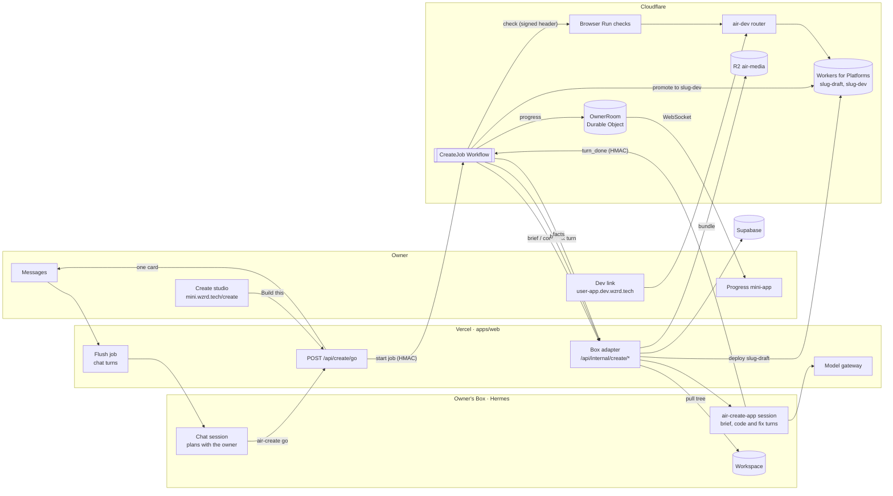
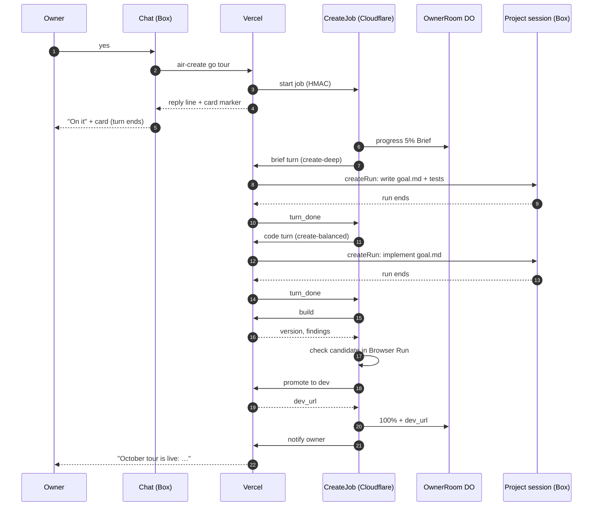

# goal.md: Air Create V13 — one job, one progress mini-app, one Cloudflare dev link

| Field | Value |
| --- | --- |
| Status | Build specification (executable plan) |
| Builds on | [docs/goal-create-v12.md](goal-create-v12.md) (intake, plan, Kit, templates, tests DSL), [docs/goal-create-v11.md](goal-create-v11.md) (Build Service, versions, Workers for Platforms), [docs/create-architecture-review.html](create-architecture-review.html) (failures F1–F10 this file fixes), [SECURITY-DECISIONS.md](../SECURITY-DECISIONS.md) |
| Primary outcome | An owner says **yes** to a plan and, without another message, gets one progress mini-app that fills live and ends on a shareable dev link at `https://<username>-<appname>.dev.wzrd.tech`, served entirely by Cloudflare |
| What changes | The build loop moves out of the chat turn and out of the model's hands into a Cloudflare Workflow. Checks move from the Box's browser to Browser Run. The dev link is served by a small Cloudflare router with no token hand-off. Progress is pushed live from a Durable Object to a mini-app instead of editing an iMessage card every 10 s |
| What stays | The planning conversation, `plan.md` delivery, the Kit, the Build Service code, the gateway, Supabase as system of record, the Next.js app on Vercel, production publishing through the owner's decision tap |
| Last verified | 2026-09-24 against `airv2` @ `add1266`, production Supabase (aggregates only) and the Cloudflare account that holds `air-media` and `air-muse` |

If this file conflicts with `ARCHITECTURE.md` or a live security decision, this file is wrong. V12 terms (`Intake`, `Plan`, `Goal`, `Template`, `Kit`, `Version`, tests DSL) keep their meaning. This file specifies the delta.

---

## 0. The outcome, as the owner sees it

```
owner   /create a landing page for my October tour with a ticket link and a countdown
air     got it — 2 quick questions before I plan this: …            (V12, unchanged)
owner   landing page. dark. tickets are on dice.fm/xyz
air     [attachment: tour-plan.md]
        "October tour" · landing · dark
        reply yes to build, or tell me what to change.
owner   yes
air     On it — building October tour now. Tap to watch.
        [card: October tour · Building]                  ← sent once, never edited
            (owner taps → progress mini-app: Brief ✓ → Code → Build → Check → Publish, live)
air     October tour is live: https://gratitude-tour.dev.wzrd.tech
        share it with anyone. tell me what to change, or say ship it.
owner   make the countdown bigger
air     On it — updating October tour. Tap to watch.
        [card: October tour · Updating]
air     Updated: https://gratitude-tour.dev.wzrd.tech
```

After "yes" the owner gets exactly two bubbles per build: the card and the result. No "I need a little more time", no progress narration, no percent text.

### 0.1 Golden paths

- **GP1 — Messages.** `/create` → ≤ 3 questions → plan → **yes** → card → dev link. Exit: works on a real line and a real Box. The "yes" turn ends in under 30 s, and the dev link loads on a phone.
- **GP2 — Change.** After a dev link exists, any change request ("make it bigger") runs the same job and moves the same dev link to the new version.
- **GP3 — Web parity.** On `mini.wzrd.tech/create`, **Build this** and **Make this change** call the same endpoint as the Box and open the same progress view.

### 0.2 Non-goals for V13

Production publishing changes (the V12 finalize → decision tap flow stays as is), the mirror to `wzrd-create`, apps with Functions (backend) on the dev link, GitHub URL imports, moving the Next.js control plane off Vercel, and replacing the Box.

---

## 1. Where things run

### 1.1 Today (verified)

| Piece | Runs on | State in production |
| --- | --- | --- |
| iMessage inbound, flush job, chat turns | Vercel (`apps/web`) | Works. 37 of 114 iMessage turns in the last 14 days hit the 120 s response deadline |
| Web Create studio (`mini.wzrd.tech/create`) | Vercel (Next.js) | Works; preview pane is empty (no draft is ever previewable) |
| Hermes agent, workspace, `air-create` CLI | The owner's Box (a VM from the Box provider) | Works |
| Build Service (pull tree → esbuild → lint → store) | Vercel function | Works: 38 of 41 builds succeeded, median 4.8 s, p90 8.4 s |
| Bundle storage | Cloudflare R2 (`air-media`) | Works: 33 draft versions stored |
| Draft / dev / live app origin (Dispatcher + Workers for Platforms) | Cloudflare, **designed but never deployed** | The account has no `air-dispatcher`, no `air-outbound`, and no manifest KV namespace. 0 of 33 versions carry a Worker digest |
| Database | Supabase | Works |

So the Create studio today is a Vercel app that stores bundles in Cloudflare R2. The Cloudflare serving half was written and never shipped.

### 1.2 Target (V13)

| Piece | Runs on | Why there |
| --- | --- | --- |
| Chat, planning, `plan.md` delivery, owner auth, studio UI | Vercel (unchanged) | Already works. Moving it is a large migration with no benefit to `/create` |
| **Job orchestration** (`CreateJob` Workflow) | **Cloudflare Workflows** | Durable steps, retries and `waitForEvent`. A waiting instance uses no CPU and holds no concurrency slot |
| **Live progress** (`OwnerRoom` Durable Object) | **Cloudflare Durable Objects** | WebSocket fan-out with hibernation; idle connections cost nothing |
| **Checks** (smoke + locked tests) | **Cloudflare Browser Run** (Playwright binding) | Removes agent-browser and preview tokens from the Box; checks are about a cent each |
| **Dev link serving** (`air-dev` router + `<slug>-dev` user Workers) | **Cloudflare Workers for Platforms** | Static asset requests on Workers are free and unlimited. Each app gets its own origin |
| Build Service | Vercel in phase A, Cloudflare Container in phase B (§7) | It already works in 5 s. Moving it is a packaging job, done after the golden path is proven |
| Box-touching calls (start a Hermes turn, pull the workspace) | Vercel "Box adapter" routes | All Box-provider and Hermes client code lives in `apps/web`, and porting it is out of scope |



---

## 2. Decisions

| ID | Decision | Rationale |
| --- | --- | --- |
| D1 | **A Workflow owns the build loop.** The model's last act in the "yes" turn is `air-create go`, after which the turn ends | Fixes F1, F3 and F6 at the root. A chat turn is request/response with a 120 s budget; a Workflow is durable, resumable and free while waiting |
| D2 | **The build decides success, not the model.** Brief, code and fix turns are best-effort edits; after each one the job builds and checks | Removes every "did the model run the right command" failure. A turn that times out simply leads to a build |
| D3 | **Stages and percent are written by the job only** | Keeps CR19 ("progress is derived, never self-reported") and removes the Box as a writer of intake events (F1) |
| D4 | **The dev link is a per-app origin on Cloudflare: `https://<username>-<appname>.dev.wzrd.tech`** | Each user's AI-generated code gets its own origin (no shared storage between apps), with no Vercel hop and no token exchange (F5, F8). Same slug shape the app origin already accepts |
| D5 | **Checks = smoke test + locked tests, run by Browser Run** | Simpler gate than V12's QA ≥ 70 plus all tests, and no Box browser. The QA score is still computed and shown, but it doesn't gate |
| D6 | **Progress is a mini-app fed by a Durable Object over WebSocket**, with polling as a fallback | One card sent once, never edited. This avoids the unproven "edit the card 12+ times" requirement (V12 MC0) |
| D7 | **Supabase stays the system of record, written by `apps/web` code in phase A** | Reuses `advanceIntake`, `uploadVersion` and `recordQaScore` unchanged. Cloudflare holds orchestration state only |
| D8 | **One running job per owner, latest request wins per app** | The Box works one project at a time (`openCreateRun`). A second request queues, and a newer one for the same app replaces a queued older one |

### 2.1 Why Cloudflare for this, honestly

- **Cheaper for this workload shape.** The expensive part today is waiting: the events route can hold a Vercel function for up to 800 s while a model thinks. A Workflow that is sleeping or waiting for an event uses no CPU and doesn't count toward concurrency. Serving is also cheaper: static asset requests on Workers are free and unlimited, and R2 has no egress fees.
- **More of the needed services are first-party and already integrated:** durable workflows, Durable Objects for live fan-out, a headless browser, per-tenant Workers, Containers. Cloudflare publishes a reference architecture for exactly this product ("AI Vibe Coding Platform", VibeSDK), which validates the shape.
- **Where it doesn't matter much:** builds take 5 s, so where they run barely moves cost. The dominant per-app cost is model tokens (brief, code and fix turns), and that's the same on either cloud. Measure it on the admin Tokens page.
- **What not to do:** don't port the whole Next.js control plane now. It carries iMessage, auth, payments and admin, and none of the `/create` failures live there.

---

## 3. Constraints added by V13

All V11/V12 C-, CR- and MA- constraints stay in force, except where a row below replaces one.

| ID | Constraint |
| --- | --- |
| CF1 | **Signed bridge.** Every Vercel ↔ Cloudflare call carries `x-air-sig = HMAC-SHA256(CREATE_BRIDGE_SECRET, ts + "." + method + "." + path + "." + sha256(body))` and `x-air-ts` within ±300 s. Unsigned or stale requests get 401 and are logged content-free |
| CF2 | **The job is the only writer** of pipeline facts: build started, build ok or failed, check results, dev live, failed. The Box never posts intake stage events after `plan_written` (replaces the V12 skill's `confirm` event) |
| CF3 | **Dev links are public-unlisted and static.** `<slug>.dev.wzrd.tech` serves only `<slug>-dev`, with `X-Robots-Tag: noindex, nofollow`, the Dispatcher's CSP, no cookies, and no Functions or bindings beyond `ASSETS`. It expires 14 days after the last successful build (`CREATE_DEV_TTL_DAYS`). Replaces CR17's `link.wzrd.tech/<u>/<a>` routing and CR23 |
| CF4 | **Candidates are never linkable.** A version is reachable before promotion only through `x-air-candidate: <token>`, a header token minted by the job for one slug and version and valid for 10 minutes. Only the check step holds it |
| CF5 | **Content stays in the Box** (CR21 unchanged). Job state, Durable Object storage and logs hold ids, counters, step names, rule ids, timings and percents only. Change requests travel as files in the workspace (`intake/changes/<n>.md`), never through Cloudflare. Check screenshots go to a private R2 prefix with a 7-day lifecycle |
| CF6 | **Checks are sandboxed.** Browser Run sessions launch with guardrails `allowedDomains = ["<slug>.dev.wzrd.tech", "media.wzrd.tech"]`, so generated code can't make the checker fetch anything else |
| CF7 | **The model never publishes.** The job promotes to dev; production stays the owner's decision tap (CR4) |
| CF8 | **Fail loud, early.** `/create` and `air-create go` check readiness first (§11.3). If any lane is off, the owner gets one clear line before any work starts, not a dead end five steps in |

---

## 4. The job

### 4.1 Lifecycle



### 4.2 Steps

`CreateJob` runs `step.do` calls, each named, idempotent and retried as listed. `round` counts fix rounds, starting at 0.

| # | Step | What it does | Retries / timeout | Progress |
| --- | --- | --- | --- | --- |
| 1 | `admit` | Load the `create_jobs` row, check readiness, and claim the owner's slot in `OwnerRoom` (or wait for it) | 3 × 5 s | 2% "Starting" |
| 2 | `brief` (kind `initial` only) | Adapter starts a **brief turn** in `air-create-<app>` on `create-deep:<slug>#plan`: "write goal.md from plan.md; copy `## Tests` into `air.json.tests`; mark ≥ 2 tests `locked`". Then `waitForEvent("turn_done", 10 min)` | turn: 1 retry; wait timeout → continue | 5 → 10% "Writing the brief" |
| 3 | `snapshot-tests` (initial only) | Adapter reads `air.json.tests[]` ids and `locked` flags and stores the locked ids on the job | 3 × 5 s | — |
| 4 | `code` | Adapter starts a **code turn** on `create-balanced:<slug>#build`. For initial jobs: "implement goal.md". For change jobs: "apply `intake/changes/<n>.md`". The turn may call `air-create compile` (build without deploy) up to 5 times. Then `waitForEvent("turn_done", 12 min)` | turn: 1 retry; wait timeout → continue | 10 → 50% "Writing code" |
| 5 | `build` | Adapter runs the existing `buildApp`: pull tree → esbuild → lint → validate → R2 → deploy `<slug>-draft`. Fails with `tests.locked-removed` if a locked id is gone | 2 × 10 s; 120 s | 50 → 60% "Building" |
| 6 | `check` | Browser Run loads the candidate through `air-dev` with the `x-air-candidate` header and runs the smoke test (§6.1) and locked tests (§6.2). It records results through the adapter | 2 × 15 s; 180 s | 60 → 85% "Checking on a phone-sized screen" |
| 7 | `fix` (only if 5 or 6 failed) | `round += 1`. If `round > CREATE_MAX_FIX_ROUNDS` (3), go to `needs_you`. Otherwise start a **fix turn** on `create-balanced:<slug>#build` with the findings (rule ids, file paths, one-line messages, failing test ids), wait for `turn_done` (10 min), then go back to step 5 | — | holds percent; detail "Fixing 2 issues (round 2 of 3)" |
| 8 | `publish` | Deploy the same version to `<slug>-dev`, then set `mini_apps.dev_version`, `dev_released_at` and `dev_expires_at` | 3 × 10 s | 85 → 99% "Publishing your link" |
| 9 | `notify` | Adapter sends one iMessage: "<Name> is live: <dev_url>" (or updated), plus the web studio toast | 3 × 10 s | 100% "Live" |
| — | `needs_you` | Terminal. Adapter sends: "I got stuck on <plain-language issue>. Tap the card to try again or tell me what to change." The mini-app shows **Try again** and **Describe a fix** | — | holds; state `stuck` |

Percent is monotonic within a job. Inside `code` it rises on a time curve toward 45% (p50 of the owner's last 20 code turns, floor 60 s) and jumps to 50% on `turn_done`. Every step writes `{percent, step, detail, round}` to `OwnerRoom`, and the adapter mirrors facts to Supabase (§9).

### 4.3 Turn-done callback

The adapter starts each turn with `startCreateTurn`-style code (opens the `create:<slug>` run row, wakes the Box, `createRun` with `#stage`). It then consumes the Hermes event stream inside `after()` on a route with `maxDuration = 800`. On the terminal event, or when the stream ends or errors, it POSTs `turn_done {run_id, outcome}` to `https://create.wzrd.tech/v1/jobs/<id>/events`, which calls `instance.sendEvent({type: "turn_done", payload})`.

If the callback never arrives, the Workflow's `waitForEvent` times out and the job moves on to `build` anyway (D2). The adapter also closes the run row, so the owner's Create slot is never left blocked (fixes the V12 run-row leak).

### 4.4 Change jobs and queueing

- `air-create go <app> --change` (Box) or **Make this change** (web) first writes the request to `intake/changes/<n>.md` in the workspace (the chat model or the studio does this through the existing files route), then starts a job of kind `change`. That job skips `brief` and `snapshot-tests`.
- `OwnerRoom` holds `{running: job_id | null, queued: {app → job_id}}`. A new job for the app that's already running is queued. A newer queued job for the same app replaces the older queued one, and the older one ends as `superseded`. A job for another app waits its turn (D8).
- **Cancel** (owner, from the mini-app) calls `instance.terminate()`, stops any running Hermes turn through the adapter, and leaves the previous dev version live.

---

## 5. Progress mini-app

### 5.1 Entry

- **Messages:** `air-create go` returns a card marker `[card: create <slug> job=<job_id>]`. The flush job's existing marker lane sends **one** create card, linking through the existing signed-login mint to `mini.wzrd.tech/create?app=<slug>&job=<job_id>`. The card is never updated in place. Delete the V12 relay ticks.
- **Web:** **Build this** and **Make this change** open the same view in place.

### 5.2 Screen (390 × 760 first)

```
┌──────────────────────────────┐
│ October tour        Building │  ← status pill: Building · Live · Stuck
│                              │
│   ███████████░░░░░░   62%    │
│   Checking on a phone-sized  │  ← one line, plain words, from `detail`
│   screen…                    │
│                              │
│ ✓ Brief            0:12      │
│ ✓ Code             1:48      │
│ ✓ Build            0:05      │
│ ● Check            0:21      │
│ ○ Publish                    │
│                              │
│ [ Cancel ]                   │
└──────────────────────────────┘
```

When live, the bar is replaced by the check screenshot, the link in large type, and **Open**, **Copy link**, **Share** (Web Share) and **Make a change**, plus **Ship it** (the existing V12 finalize flow). When stuck, it shows the issue in plain words with **Try again** (a new job with `round = 0`) and **Describe a fix** (focuses the chat).

Copy rules: name steps by what the owner recognizes (Brief, Code, Build, Check, Publish), not by system names. Never show rule ids to the owner. The adapter maps them to a sentence ("a button is off the edge of the screen").

### 5.3 Transport

1. The page calls `GET /api/create/jobs/<id>/live-token` (store session) → `{url: "wss://create.wzrd.tech/v1/jobs/<id>/live", token}`, where the token is an HMAC over `{job, user, exp: now + 10 min}`.
2. The page opens the WebSocket and sends the token as its first message. `OwnerRoom` verifies it, checks the `Origin` header is `https://mini.wzrd.tech`, and accepts with the Hibernation API (`ctx.acceptWebSocket`, tag = job id). It sends the current snapshot right away.
3. Every progress write broadcasts `{percent, step, detail, round, state, dev_url?, shot_url?}` to that job's sockets.
4. **Fallback:** if the socket fails twice, poll `GET https://create.wzrd.tech/v1/jobs/<id>?t=<token>` every 3 s. Reconnect on `visibilitychange`.

---

## 6. Checks (Browser Run)

`env.BROWSER` is launched through `@cloudflare/playwright` with the CF6 guardrails. The candidate URL is `https://<slug>.dev.wzrd.tech/`, with `x-air-candidate` set through `page.setExtraHTTPHeaders` so the page and every asset request route to `<slug>-draft`.

### 6.1 Smoke test (gate)

Run at 390 × 760 with reduced motion, then once at 1280 × 800. Fail if any of these happen:

- the document or any same-origin asset returns ≥ 400
- an uncaught page error, or any `console.error`
- a blank render: under 20 visible text characters and no `canvas`, `svg` or `img` in view, 1.5 s after `load`
- horizontal overflow: `scrollWidth > innerWidth + 2`
- a request blocked by CSP

Save a 390 × 760 PNG to `create-shots/<job>/<round>.png` (private).

### 6.2 Tests (gate: locked only)

Execute `air.json.tests[]` with the V12 DSL (`see`, `missing`, `tap`, `type`, `wait`, `changed`, `expectHref`, `viewport`) as anonymous visitors (V13 drops `role`). Locked tests must pass. Unlocked failures are reported to the fix turn and shown to the owner, but don't block.

### 6.3 Score

The V11 QA score is computed from the same run and stored on the version (`recordQaScore`). It's informational in V13 (replaces the CR22 gate).

---

## 7. Build and deploy

### 7.1 Phase A — keep the Build Service, make its lane real

The job calls `POST /api/internal/create/build`, which runs the existing `buildApp` unchanged. With the app-origin env vars finally set (§11.2), `uploadVersion` deploys `<slug>-draft` through the existing Workers for Platforms upload code. `POST /api/internal/create/publish-dev` then runs the existing `promoteToDev` with its URL changed to `https://<slug>.dev.wzrd.tech/`.

### 7.2 Phase B — Container (after GP1 is green for two weeks)

Package `lib/create/{build,kit,css,lint,versions}.ts` and their deps as a Node service in a Cloudflare Container (`basic`: 1/4 vCPU, 1 GiB). Inputs: a workspace tarball the adapter snapshots to R2 (`create-src/<job>/<round>.tgz`) and the Kit baked into the image. Outputs: the version in R2 and the draft deploy. The Workflow calls it through a Container binding, and `/api/internal/create/build` is deleted. At 5 s per build, compute is a fraction of a cent. The gains are one less cross-cloud hop and no 300 s Vercel ceiling.

### 7.3 Dev router (`air-dev`)

About 100 lines, routed on `*.dev.wzrd.tech/*` and bound to the `air-apps` dispatch namespace:

1. Parse the slug from the host using the Dispatcher's regex (`^[a-z0-9_]{2,24}-[a-z0-9](?:[a-z0-9-]{0,30}[a-z0-9])?$`). Anything else returns 404.
2. If `x-air-candidate` is present and valid for this slug, target `<slug>-draft`. Otherwise target `<slug>-dev`.
3. `env.APPS.get(script).fetch(request)`. A missing script returns a branded 404 ("this dev link has expired or doesn't exist").
4. Add `X-Robots-Tag: noindex, nofollow`, the Dispatcher's CSP, `Referrer-Policy: no-referrer`, and `Cache-Control: no-store` on HTML.

There are no cookies, tokens, KV lookups or Supabase calls on the hot path. Expiry and revocation delete the `<slug>-dev` script: a daily cron in `air-create` reads `mini_apps.dev_expires_at` through the adapter, and the owner or an operator can revoke at any time.

---

## 8. Box and skill changes (`create-miniapp` v5)

`SKILL.md` §6 shrinks to the conversation. `air-create` keeps these commands:

| Command | Used by | Does |
| --- | --- | --- |
| `plan <app> --deliver` | chat | Unchanged. The server now accepts `plan_written` from `asking`, `planning`, `plan_sent` and `revising` |
| `go <app> [--change]` | chat, after "yes" or a change request | Calls `POST /api/create/go`. Prints the one reply line and the card marker. **The turn ends here** |
| `compile <app>` | code and fix turns | Calls the build in dry-run mode (compile, lint, validate; no store, no deploy) and returns findings. Max 5 per turn |
| `status <app>` | any | Unchanged, plus `job` (`state`, `percent`, `dev_url`) |

Remove from the skill's golden path: `confirm`, `build`, `qa`, `test` and `release`. Keep them working for one release, printing "the job does this now". Delete `air-qa.py` from the template in M5.

Code and fix turns get this contract as `instructions` from the adapter: "Edit only `src/` and `public/` (and `air.json` fields other than `tests`). Read `goal.md` and the latest `intake/changes/<n>.md`. You may run `air-create compile`. Do not run `go`, `build` or `release`. End with one line saying what you changed."

The skill must also write `intake/prompt.md` itself on the first `/create` turn, fixing the V12 promise nobody kept. Templates ship in the Box template under `skills/create-miniapp/templates/` (harvest path addition). `air-create` sends `x-air-skill: 5` on every call, and `/api/create/go` refuses older skills with "your Box needs an update; I've queued it" plus a fleet sync (F10).

---

## 9. Control plane (Vercel) changes

### 9.1 Routes

| Route | Auth | Purpose |
| --- | --- | --- |
| `POST /api/create/go` | store session or Box token | `{appname, kind: "initial" \| "change"}`. Checks readiness (CF8). Initial: requires `plan.md` delivered (intake at `plan_sent` or `revising`), moves intake to `confirmed`, ensures the `mini_apps` row (`app_id` set, fixing F6's root). Inserts `create_jobs` and starts the Workflow. Returns `{job_id, reply, card}` |
| `POST /api/internal/create/turn` | CF1 | `{job_id, role: brief \| code \| fix, round, findings?}` → starts the Hermes run in `air-create-<app>` with `create-<tier>:<slug>#<stage>`. Consumes events in `after()` and calls back `turn_done` |
| `POST /api/internal/create/build` | CF1 | `{job_id, dry?}` → `buildApp`. Writes `build_started` / `build_ok` / `fail` to the intake |
| `POST /api/internal/create/tests` | CF1 | `{job_id}` → `{ids, locked}` from the workspace's `air.json` |
| `POST /api/internal/create/facts` | CF1 | `{job_id, check: {smoke, locked_passed, locked_total, score}}` → `recordQaScore`, intake `qa_ok` / `tests_ok` |
| `POST /api/internal/create/publish-dev` | CF1 | `{job_id, version}` → `promoteToDev`, intake `dev_live`, returns `dev_url` |
| `POST /api/internal/create/notify` | CF1 | `{job_id, outcome}` → one iMessage (Spectrum) and the web toast |
| `GET /api/create/jobs/:id/live-token` | store session | §5.3 |
| `POST /api/create/jobs/:id/{retry,cancel}` | store session | Relays to Cloudflare (CF1) |

### 9.2 Fixes carried in the same change

- `advanceIntake` accepts `plan_written` from `asking` and `planning`; the flush hook records `owner_reply` for the owner's next message while an intake is at `asking` (F1).
- `release`, `finalize` and `icon` resolve the owner's app by app name first, and fall back to the flat slug only when that misses (F4).
- The Dispatcher's enter redirect goes to `/` after token redemption (F5, still needed for the live app origin).
- Web turns carry the `[create-intake …]` marker when an intake is open. `turn.ts` adds `#stage` (F7).
- Delete: the flush-side progress relay (`startRelayForOwner`, 10 s card ticks), the dev branch of the link-host middleware, and the `x-mini-channel: dev` loader branch once the router is live.

---

## 10. Data

Migration `0126_create_jobs.sql`:

```sql
create table create_jobs (
  id              uuid primary key default gen_random_uuid(),
  user_id         uuid not null references users(id) on delete cascade,
  app_id          uuid not null references mini_apps(id) on delete cascade,
  intake_id       uuid references create_intakes(id) on delete set null,
  kind            text not null check (kind in ('initial','change')),
  state           text not null default 'queued'
                  check (state in ('queued','running','live','stuck','cancelled','superseded','failed')),
  step            text,
  percent         smallint not null default 0 check (percent between 0 and 100),
  round           smallint not null default 0,
  workflow_id     text unique,
  version         text,
  dev_url         text,
  locked_test_ids text[] not null default '{}',
  error_rule      text,               -- a rule id or test id, never message text
  created_at      timestamptz not null default now(),
  started_at      timestamptz,
  finished_at     timestamptz,
  updated_at      timestamptz not null default now()
);
create index on create_jobs (user_id, created_at desc);
create unique index one_running_job_per_owner on create_jobs (user_id) where state = 'running';
alter table create_jobs enable row level security;
create policy own_jobs on create_jobs for select using (user_id = auth.uid());
```

Add `create_jobs` to `V9_USER_TABLES` and `EXPORT_TABLES`. `create_intakes.stage` stays, and the adapter keeps it in sync with the job, so the V12 admin funnel keeps working.

---

## 11. Cloudflare setup

### 11.1 Workers (all in `infra/workers/`, deployed by CI)

`infra/workers/create/wrangler.jsonc` (new):

```jsonc
{
  "name": "air-create",
  "main": "src/index.ts",
  "compatibility_date": "2026-09-01",
  "compatibility_flags": ["nodejs_compat"],
  "routes": [{ "pattern": "create.wzrd.tech", "custom_domain": true }],
  "workflows": [{ "name": "create-job", "binding": "CREATE_JOB", "class_name": "CreateJob" }],
  "durable_objects": { "bindings": [{ "name": "OWNER_ROOM", "class_name": "OwnerRoom" }] },
  "migrations": [{ "tag": "v1", "new_sqlite_classes": ["OwnerRoom"] }],
  "browser": { "binding": "BROWSER" },
  "r2_buckets": [{ "binding": "MEDIA", "bucket_name": "air-media" }],
  "dispatch_namespaces": [{ "binding": "APPS", "namespace": "air-apps" }],
  "triggers": { "crons": ["17 4 * * *"] },       // dev-link expiry sweep
  "limits": { "cpu_ms": 60000 }
}
```

`infra/workers/dev-router/wrangler.jsonc` (new): `name: "air-dev"`, route `*.dev.wzrd.tech/*` on zone `wzrd.tech`, the `APPS` dispatch namespace binding, and the secret `CANDIDATE_SECRET`.

Existing: `air-dispatcher` and `air-outbound` get their real KV ids committed in place of the `REPLACE_WITH_…` placeholders. KV ids are identifiers, not secrets.

### 11.2 Secrets and env

| Where | Name | Notes |
| --- | --- | --- |
| Cloudflare `air-create` | `CREATE_BRIDGE_SECRET`, `CANDIDATE_SECRET`, `LIVE_TOKEN_SECRET`, `CONTROL_PLANE_ORIGIN` | `wrangler secret put` from CI |
| Cloudflare `air-dev` | `CANDIDATE_SECRET` | Same value as above |
| Vercel | `CREATE_BRIDGE_SECRET`, `LIVE_TOKEN_SECRET`, `CREATE_JOBS_ORIGIN=https://create.wzrd.tech`, `CREATE_DEV_ORIGIN_SUFFIX=dev.wzrd.tech`, and the app-origin lane: `APP_ORIGIN_SIGNING_KEY`, `CLOUDFLARE_ACCOUNT_ID`, `CLOUDFLARE_API_TOKEN` (Workers Scripts: Edit), `CF_MANIFEST_KV_ID`, `CF_DISPATCH_NAMESPACE=air-apps` | Without the lane vars, `/api/create/go` refuses (CF8) |
| GitHub Actions | `CLOUDFLARE_API_TOKEN`, `CLOUDFLARE_ACCOUNT_ID` | New workflow `.github/workflows/workers.yml`: on push to `main` touching `infra/workers/**`, run `wrangler deploy` for each Worker, then `/v1/health` |

### 11.3 Readiness

`GET https://create.wzrd.tech/v1/health` checks the Workflow binding, the `OwnerRoom` round-trip, a Browser Run launch (cached 10 min), `APPS.get("air-canary-dev")`, an R2 head and a signed ping to Vercel. `GET /api/admin/create/health` (Vercel) checks R2, the app-origin lane vars, `CREATE_JOBS_ORIGIN` reachability and the Box skill version. `/api/create/go` requires both to be green (cached 60 s).

---

## 12. Failure map (review → V13)

| Review finding | Fixed by |
| --- | --- |
| F1 intake never leaves `asking` | §9.2 transition fix; the job writes every later stage (CF2) |
| F2 app-origin lane off | §11: CI-deployed Workers, lane env set, readiness gate |
| F3 build loop in a 120 s turn | D1: the turn ends at `air-create go` |
| F4 hyphenated names | §9.2 resolution order; the job addresses apps by `app_id` |
| F5 enter redirect 404 | Dev links don't use it (§7.3); fixed anyway for the live origin (§9.2) |
| F6 progress card never starts | D6: a Durable Object and mini-app, fed by the job |
| F7 two surfaces diverge | Both call `/api/create/go`; all code turns run in the project session with `#stage` |
| F8 dev host off, sweeps unwired | The dev router on Cloudflare; the expiry cron in `air-create` |
| F9 Box contract gaps | §8: skill v5, templates shipped, tests snapshot by the job, guest tests dropped |
| F10 no version handshake | §8 `x-air-skill` header |

---

## 13. Milestones

Spine: M0 → M1 → M2 → M3 → M4. M5 and M6 run in parallel after M2.

| Milestone | Scope | Exit |
| --- | --- | --- |
| **M0 — Cloudflare proofs** (script, not a document) | Workers for Platforms enabled and `air-apps` exists. `*.dev.wzrd.tech` DNS and certificate. A canary static user Worker deployed through the API and served by `air-dev`. Browser Run loads it with a candidate header. A Workflow `waitForEvent` round-trip with a signed Vercel callback. The adapter starts a turn on a real Box and the callback arrives | `scripts/create-v13-m0.ts` exits 0 and writes `docs/reports/create-v13-m0.md` |
| **M1 — Dev link** | `air-dev` router, lane env set, Dispatcher placeholders fixed, `workers.yml`, `promoteToDev` on the new host, admin `POST /api/admin/create/apps/<slug>/dev` | An operator promotes one of the 33 existing drafts, and it loads at `https://<slug>.dev.wzrd.tech` on a phone |
| **M2 — The job** | `air-create` Worker (`CreateJob`, `OwnerRoom`), internal adapter routes, `/api/create/go`, migration 0126, skill v5, `notify` | GP1 on a real line. The "yes" turn is under 30 s; the dev link arrives as the second bubble |
| **M3 — Progress mini-app** | Live-token route, WebSocket and polling client, the §5.2 screen, web **Build this** / **Make this change**, cancel and retry | GP3. The mini-app reaches 100% with no refresh; kill the socket mid-build and polling takes over |
| **M4 — Checks and fix loop** | Browser Run smoke and locked tests, fix turns, `needs_you` copy, screenshots | A seeded broken app (console error) produces a fix round and goes live. A locked-test removal fails with `tests.locked-removed` |
| **M5 — Delete** | Remove relay ticks, the link-host dev branch, the loader dev branch, `air-qa.py`, V12 skill steps and the Box-side intake events | Net negative lines. All suites green |
| **M6 — Keep it proven** | Nightly E2E: a synthetic owner on a staging Box drives GP1 and GP2 and asserts every step timestamp and a 200 on the dev link. The readiness checks page ops when red | Seven green nights before the V13 flag defaults on |
| M7 (optional) — Build in a Container | §7.2 | Build p90 ≤ 15 s from the Container; `/api/internal/create/build` deleted |

Flag: `CREATE_V13=true` routes `air-create go` and **Build this** through the job. With it off, V12 behavior stays, so the rollout is reversible per owner (`CREATE_V13_USER_IDS` allow-list first).

---

## 14. Acceptance criteria

- The "yes" turn returns in under 30 s, and the owner sees exactly two new bubbles for the build: the card, then the link or the stuck message.
- The progress mini-app shows a percent that never goes down within a job, step names from §5.2, and the dev link at 100%.
- `https://<slug>.dev.wzrd.tech` serves the promoted version to a logged-out phone with `noindex`, and 404s after revoke or expiry.
- A candidate is unreachable without a valid `x-air-candidate` header (tested with an expired token, one for another slug and one for another version).
- Browser Run sessions can't reach hosts outside CF6 (tested with an app that fetches `example.com`: the request is blocked and the smoke test records it).
- Killing the Vercel adapter mid-turn doesn't strand the job. It continues to `build` after the `waitForEvent` timeout.
- Two requests for the same app while a job runs leave one queued job, and the older request ends `superseded`.
- `create_jobs`, the DO storage and the logs contain no prompt, plan, goal or code text (grep test over a full GP1 run).
- Budget: brief turns meter as `create_stage = plan`, code and fix turns as `build`. The admin Tokens page shows both for one job.

---

## 15. Cost model (list prices from Cloudflare docs, Sep 2026)

| Item | Price | Per app build |
| --- | --- | --- |
| Workers Paid base | $5 / month; 10 M requests and 30 M CPU-ms included; then $0.30 / M requests and $0.02 / M CPU-ms | Job steps and the router use milliseconds of CPU |
| Static asset requests (dev links) | Free and unlimited | $0 to serve |
| Workflows | Billed like Workers (requests and CPU) plus stored state (confirm on the pricing page in M0); waiting and sleeping instances use no CPU and don't count toward concurrency | ~$0 |
| Durable Objects (WebSocket hibernation) | Idle sockets don't bill duration | ~$0 |
| Browser Run | 10 browser-hours / month and 10 concurrent included; then $0.09 per browser-hour | ~1.5 browser-minutes per round, so ~400 builds / month fit in the included hours |
| Containers (M7 only) | Per 10 ms active; `basic` = 1/4 vCPU, 1 GiB; 25 GiB-h memory and 375 vCPU-min / month included | A 5 s build is a fraction of a cent |
| Workers for Platforms | Separate subscription (confirm in M0) | Two scripts per app (`-draft`, `-dev`) |
| **Model tokens** | GMI list prices via the gateway | **The dominant cost.** Measure per job on the admin Tokens page |

---

## 16. Open decisions for the owner

1. **Dev link hostname.** Recommended: `https://<username>-<appname>.dev.wzrd.tech` (per-app origin, isolated). The alternative, `link.wzrd.tech/<u>/<a>`, is prettier but puts every user's generated code on one shared origin unless it redirects to the per-app host. It could be added later as a redirect.
2. **Gate strictness.** Recommended: smoke test plus locked tests; QA score informational. Stricter (V12's QA ≥ 70 plus all tests) means fewer broken links and more stuck jobs.
3. **Where planning runs.** Recommended: keep the planning conversation in the chat session (`air-main` on Messages, the project session on the web), with brief, code and fix turns always in the project session. Moving Messages planning into the project session too would unify context, but needs routing rules for mixed conversations.
4. **When to move the build into a Container** (M7). Recommended: after two green weeks of GP1, since builds are already fast and cheap on Vercel.
5. **The 90-day freeze on new mini-apps, skills, card kinds and decision kinds (CA-19).** Lifted. The freeze was written when nothing enforced the discipline; the CI gates now in force — typecheck, lint, tests and build on every pull request — take over that job, so new kinds land when the work clears them rather than after a date on the calendar.

---

## 17. Alternatives considered

- **Vercel Workflow instead of Cloudflare Workflows.** Viable. Rejected because serving, checks and live fan-out want Cloudflare anyway, and one orchestrator next to them is simpler.
- **Dynamic Workers (Worker Loader) for dev links** instead of per-app Workers for Platforms scripts. That means no deploy step. Rejected for now: it's in open beta, it bills per unique Worker per day, and Workers for Platforms upload code already exists. Revisit for previews.
- **Cloudflare Sandbox or VibeSDK to replace the Box.** Out of scope. The Box holds the owner's agent, memory and tools. VibeSDK is useful as a reference for the job, preview and deploy shape.
- **Serving dev links from R2 through one shared router** (no per-app Worker). Cheapest, but every app would share one origin. Rejected (CF3).
